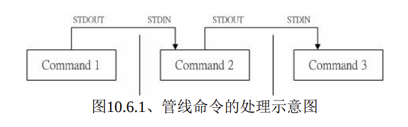
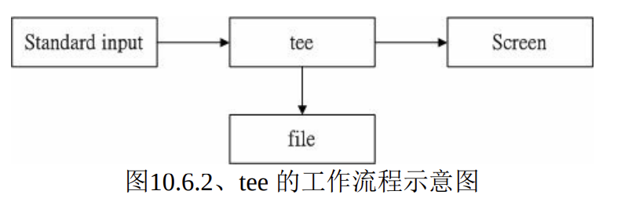
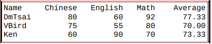
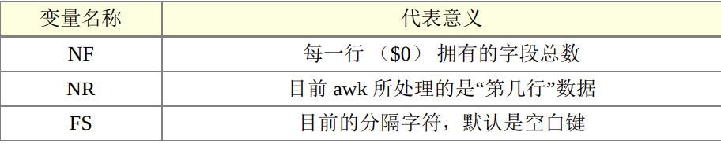
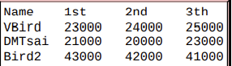
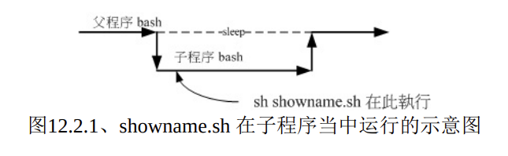
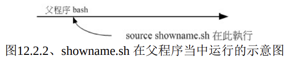

# Linux

## Shell

### 变量

例题： 请在屏幕上面显示出您的环境变量 HOME 与 MAIL：

```shell
 echo $HOME 或者是 echo ${HOME} 
 echo $MAIL 或者是 echo ${MAIL}
```

那么我要如何“设置”或者是“修改” 某个变 量的内容啊？

```shell
[dmtsai@study ~]$ echo ${myname}
<==这里并没有任何数据～因为这个变量尚未被设置！是空的！
[dmtsai@study ~]$ myname=VBird
[dmtsai@study ~]$ echo ${myname}
VBird <==出现了！因为这个变量已经被设置了！

```

#### 变量的设置规则

> \1. 变量与变量内容以一个等号“=”来链接，如下所示： “myname=VBird”
>
> \2. 等号两边不能直接接空白字符，如下所示为错误： “myname = VBird”或“myname=VBird Tsai”
>
> \3. 变量名称只能是英文字母与数字，但是开头字符不能是数字，如下为错误： “2myname=VBird”
>
> \4. 变量内容若有空白字符可使用双引号 **"** 或单引号 **'** 将变量内容结合起来，但 
>
> 双引号内的特殊字符如 **$** 等，可以保有原本的特性，如下所示：
>
> ```shell
>  var="lang is $LANG"    
>  echo $var   
>  lang is zh_TW.UTF-8
> ```
>
> 单引号内的特殊字符则仅为一般字符 （纯文本），如下所示： 
>
> ```shell
> var='lang is $LANG'
> echo $var
> lang is $LANG
> ```
>
> \5. 可用跳脱字符 **\\** 将特殊符号（如 **[Enter], $, \, 空白字符, '**等）变成一般字符，如：
>
> ```shell
> myname=VBird\ Tsai
> ```
>
> \6. 在一串指令的执行中，还需要借由其他额外的指令所提供的信息时，可以使用反单引号**\`指令\`**或 **$ （指令）**。特别注意，那个 **`** 是键盘上方的数字键 1 左边那个按键，而不是单引号！ 例如想要取得核 心版本的设置：
>
> ```shell
> version=$（uname -r）
> echo $version
> 3.10.0-229.el7.x86_64
> ```
>
> \7. 若该变量为扩增变量内容时，则可用 **"$变量名称"** 或 **${变量}** 累加内容，如下所示： 
>
> ```shell
> PATH="$PATH":/home/bin 或  PATH=${PATH}:/home/bin
> ```
>
> \8. 若该变量需要在其他子程序执行，则需要以 export 来使变量变成环境变量： “export PATH”
>
> \9. 通常大写字符为系统默认变量，自行设置变量可以使用小写字符，方便判断 （纯粹依照使用者兴趣与 嗜好） ；
>
> \10. 取消变量的方法为使用 unset ：“unset 变量名称”例如取消 myname 的设置： “unset myname”


范例一：设置一变量 name ，且内容为 VBird 

```shell
[dmtsai@study ~]$ 12name=VBird 

bash: 12name=VBird: command not found... <==屏幕会显示错误！因为不能以数字开头！

 [dmtsai@study ~]$ name = VBird <==还是错误！因为有空白！

 [dmtsai@study ~]$ name=VBird <==OK 的啦！
```

范例二：承上题，若变量内容为 VBird's name 呢，就是变量内容含有特殊符号时：

```shell
[dmtsai@study ~]$ name=VBird's name
# 单引号与双引号必须要成对，在上面的设置中仅有一个单引号，因此当你按下 enter 后，
# 你还可以继续输入变量内容。这与我们所需要的功能不同，失败啦！
# 记得，失败后要复原请按下 [ctrl]-c 结束！
[dmtsai@study ~]$ name="VBird's name" <==OK 的啦！
# 指令是由左边向右找→，先遇到的引号先有用，因此如上所示， 单引号变成一般字符！
[dmtsai@study ~]$ name='VBird's name' <==失败的啦！
# 因为前两个单引号已成对，后面就多了一个不成对的单引号了！因此也就失败了！
[dmtsai@study ~]$ name=VBird\'s\ name <==OK 的啦！
# 利用反斜线 （\） 跳脱特殊字符，例如单引号与空白键，这也是 OK 的啦！
```

范例三：我要在 PATH 这个变量当中“累加”:/home/dmtsai/bin 这个目录

```shell
[dmtsai@study ~]$ PATH=$PATH:/home/dmtsai/bin
[dmtsai@study ~]$ PATH="$PATH":/home/dmtsai/bin
[dmtsai@study ~]$ PATH=${PATH}:/home/dmtsai/bin
# 上面这三种格式在 PATH 里头的设置都是 OK 的！但是下面的例子就不见得啰！
```

范例四：承范例三，我要将 name 的内容多出 "yes" 呢？

```shell
[dmtsai@study ~]$ name=$nameyes
# 知道了吧？如果没有双引号，那么变量成了啥？name 的内容是 $nameyes 这个变量！
Tips
# 呵呵！我们可没有设置过 nameyes 这个变量呐！所以，应该是下面这样才对！
[dmtsai@study ~]$ name="$name"yes
[dmtsai@study ~]$ name=${name}yes <==以此例较佳！
```

范例五：如何让我刚刚设置的 name=VBird 可以用在下个 shell 的程序？

```shell
[dmtsai@study ~]$ name=VBird
[dmtsai@study ~]$ bash <==进入到所谓的子程序
[dmtsai@study ~]$ echo $name <==子程序：再次的 echo 一下；
<==嘿嘿！并没有刚刚设置的内容喔！
[dmtsai@study ~]$ exit <==子程序：离开这个子程序
[dmtsai@study ~]$ export name
[dmtsai@study ~]$ bash <==进入到所谓的子程序
[dmtsai@study ~]$ echo $name <==子程序：在此执行！
VBird <==看吧！出现设置值了！
[dmtsai@study ~]$ exit <==子程序：离开这个子程序
```

#### shell子程序简述

> 什么是“**子程序**”呢？就是说，在我目前这个 shell 的情况下，去启用另一个新的 shell ，新的那个 shell 就是子程序啦！在一般的状态下，父程序的自订变量是无法在子程序内使用的。但是通过 export 将变 量变成环境变量后，就能够在子程序下面应用了！

范例六：如何进入到您目前核心的模块目录？

```shell
[dmtsai@study ~]$ cd /lib/modules/`uname -r`/kernel
[dmtsai@study ~]$ cd /lib/modules/$（uname -r）/kernel # 以此例较佳！
```

范例七：取消刚刚设置的 name 这个变量内容

```shell
[dmtsai@study ~]$ unset name
```


例题： 在变量的设置当中，单引号与双引号的用途有何不同？

> 答： 单引号与双引号的最大不同在于双引号仍然可以保有变量的内容，但单引号内仅能是一般字符 ，而不会有特殊符号。我们以下面的例子做说明：假设您定义了一个变量， name=VBird ，现 在想以 name 这个变量的内容定义出 myname 显示 VBird its me 这个内容，要如何订定呢？
>
> ```shell
> [dmtsai@study ~]$ name=VBird
> [dmtsai@study ~]$ echo $name
> VBird
> [dmtsai@study ~]$ myname="$name its me"
> [dmtsai@study ~]$ echo $myname
> VBird its me
> [dmtsai@study ~]$ myname='$name its me'
> [dmtsai@study ~]$ echo $myname
> $name its me
> ```
>
> 发现了吗？没错！使用了单引号的时候，那么 $name 将失去原有的变量内容，仅为一般字符的 显示型态而已！这里必需要特别小心在意！

例题： 在指令下达的过程中，反单引号（ ` ）这个符号代表的意义为何？

> 答： 在一串指令中，在 **` 之内的指令将会被先执行**，而**其执行出来的结果将做为外部的输入信息**！ 例如 uname -r 会显示出目前的核心版本，而我们的核心版本在 /lib/modules 里面，因此，你可 以先执行 uname -r 找出核心版本，然后再以“ cd 目录”到该目录下，当然也可以执行如同上面范 例六的执行内容啰。 
>
> 另外再举个例子，我们也知道， locate 指令可以列出所有的相关文件文件名，但是，如果我想 要知道各个文件的权限呢？举例来说，我想要知道每个 crontab 相关文件名的权限：
>
> ```shell
> [dmtsai@study ~]$ ls -ld `locate crontab`
> [dmtsai@study ~]$ ls -ld $（locate crontab）
> ```
>
> 如此一来，先以 locate 将文件名数据都列出来，再以 ls 指令来处理的意思啦！瞭了吗？ ^_^

例题： 若你有一个常去的工作目录名称为：“/cluster/server/work/taiwan_2015/003/”，如何进行该目录的 简化？

> 答： 在一般的情况下，如果你想要进入上述的目录得要“cd /cluster/server/work/taiwan_2015/003/”， 以鸟哥自己的案例来说，鸟哥跑数值模式常常会设置很长的目录名称（避免忘记），但如此一 来变换目录就很麻烦。 此时，鸟哥习惯利用下面的方式来降低指令下达错误的问题：
>
> ```shell
> [dmtsai@study ~]$ work="/cluster/server/work/taiwan_2015/003/"
> [dmtsai@study ~]$ cd $work
> ```
>
> 未来我想要使用其他目录作为我的模式工作目录时，只要变更 work 这个变量即可！而这个变 量又可以在 bash 的配置文件（~/.bashrc）中直接指定，那我每次登陆只要执行“ cd $work ”就能 够去到数值模式仿真的工作目录了！是否很方便呢？ ^_^

#### 系统默认环境变量

```shell
[dmtsai@study ~]$ env
HOSTNAME=study.centos.vbird <== 这部主机的主机名称
TERM=xterm <== 这个终端机使用的环境是什么类型
SHELL=/bin/bash <== 目前这个环境下，使用的 Shell 是哪一个程序？
HISTSIZE=1000 <== “记录指令的笔数”在 CentOS 默认可记录 1000 笔
OLDPWD=/home/dmtsai <== 上一个工作目录的所在
LC_ALL=en_US.utf8 <== 由于语系的关系，鸟哥偷偷丢上来的一个设置
USER=dmtsai <== 使用者的名称啊！
LS_COLORS=rs=0:di=01;34:ln=01;36:mh=00:pi=40;33:so=01;35:do=01;35:bd=40;33;01:cd=40;33;01:
or=40;31;01:mi=01;05;37;41:su=37;41:sg=30;43:ca=30;41:tw=30;42:ow=34;42:st=37;44:ex=01;32:
*.tar=01... <== 一些颜色显示
MAIL=/var/spool/mail/dmtsai <== 这个使用者所取用的 mailbox 位置
PATH=/usr/local/bin:/usr/bin:/usr/local/sbin:/usr/sbin:/home/dmtsai/.local/bin:/home/dmtsai/bin
PWD=/home/dmtsai <== 目前使用者所在的工作目录 （利用 pwd 取出！）
LANG=zh_TW.UTF-8 <== 这个与语系有关，下面会再介绍！
HOME=/home/dmtsai <== 这个使用者的主文件夹啊！
LOGNAME=dmtsai <== 登陆者用来登陆的帐号名称
_=/usr/bin/env <== 上一次使用的指令的最后一个参数（或指令本身）
```

> HOME
> 代表使用者的主文件夹。还记得我们可以使用 cd ~ 去到自己的主文件夹吗？或者利用 cd 就可以直接回
> 到使用者主文件夹了。那就是取用这个变量啦～ 有很多程序都可能会取用到这个变量的值！
> SHELL
> 告知我们，目前这个环境使用的 SHELL 是哪支程序？ Linux 默认使用 /bin/bash 的啦！
> HISTSIZE
> 这个与“历史命令”有关，亦即是， 我们曾经下达过的指令可以被系统记录下来，而记录的“笔数”则是由
> 这个值来设置的。
> MAIL
> 当我们使用 mail 这个指令在收信时，系统会去读取的邮件信箱文件 （mailbox）。
> PATH
> 就是可执行文件搜寻的路径啦～目录与目录中间以冒号（:）分隔， 由于文件的搜寻是依序由 PATH 的
> 变量内的目录来查询，所以，目录的顺序也是重要的喔。
> LANG
> 这个重要！就是语系数据啰～很多讯息都会用到他， 举例来说，当我们在启动某些 perl 的程序语言文件
> 时，他会主动的去分析语系数据文件， 如果发现有他无法解析的编码语系，可能会产生错误喔！一般来
> 说，我们中文编码通常是 zh_TW.Big5 或者是 zh_TW.UTF-8，这两个编码偏偏不容易被解译出来，所
> 以，有的时候，可能需要修订一下语系数据。 这部分我们会在下个小节做介绍的！
> RANDOM
> 这个玩意儿就是“随机乱数”的变量啦！目前大多数的 distributions 都会有乱数产生器，那就是
> /dev/random 这个文件。 我们可以通过这个乱数文件相关的变量 （$RANDOM） 来随机取得乱数值喔。
> 在 BASH 的环境下，这个 RANDOM 变量的内容，介于 0~32767 之间，所以，你只要 echo $RANDOM
> 时，系统就会主动的随机取出一个介于 0~32767 的数值。万一我想要使用 0~9 之间的数值呢？呵呵～利
> 用 declare 宣告数值类型， 然后这样做就可以了：

#### 读取终端用户的输入 

##### **Read**

要读取来自键盘输入的变量，就是用 read 这个指令了。这个指令最常被用在 shell script 的撰写当 中， 想要跟使用者对谈？

```shell
[dmtsai@study ~]$ read [-pt] variable 选项与参数：
-p ：后面可以接提示字符！
-t ：后面可以接等待的“秒数！”这个比较有趣～不会一直等待使用者啦！
```

范例一：让使用者由键盘输入一内容，将该内容变成名为 atest 的变量

```shell
[dmtsai@study ~]$ read atest
This is a test <==此时光标会等待你输入！请输入左侧文字看看
[dmtsai@study ~]$ echo ${atest}
This is a test <==你刚刚输入的数据已经变成一个变量内容！
```

范例二：提示使用者 30 秒内输入自己的大名，将该输入字串作为名为 named 的变量内容

```shell
[dmtsai@study ~]$ read -p "Please keyin your name: " -t 30 named
Please keyin your name: VBird Tsai <==注意看，会有提示字符喔！
[dmtsai@study ~]$ echo ${named}
VBird Tsai <==输入的数据又变成一个变量的内容了！
```

##### declare / typeset

> declare 或 typeset 是一样的功能，就是在“宣告变量的类型”。如果使用 declare 后面并没有接任何参 数，那么 bash 就会主动的将所有的变量名称与内容通通叫出来，就好像使用 set 一样啦！

```shell
[dmtsai@study ~]$ declare [-aixr] variable 选项与参数：
-a ：将后面名为 variable 的变量定义成为阵列 （array） 类型
-i ：将后面名为 variable 的变量定义成为整数数字 （integer） 类型
-x ：用法与 export 一样，就是将后面的 variable 变成环境变量；
-r ：将变量设置成为 readonly 类型，该变量不可被更改内容，也不能 unset
```

范例一：让变量 sum 进行 100+300+50 的加总结果

```shell
[dmtsai@study ~]$ sum=100+300+50
[dmtsai@study ~]$ echo ${sum}
100+300+50 <==咦！怎么没有帮我计算加总？因为这是文字体态的变量属性啊！
[dmtsai@study ~]$ declare -i sum=100+300+50
[dmtsai@study ~]$ echo ${sum}
450 <==瞭乎？？
```

由于在默认的情况下面， bash 对于变量有几个基本的定义：

> 变量类型默认为“字串”，所以若不指定变量类型，则 1+2 为一个“字串”而不是“计算式”。 所以上述第 一个执行的结果才会出现那个情况的；
>
> bash 环境中的数值运算，默认最多仅能到达整数形态，所以 1/3 结果是 0；

#### 系统用户资源配额

##### ulimit

> 想像一个状况：我的 Linux 主机里面同时登陆了十个人，这十个人不知怎么搞的， 同时打开了 100 个文件，每个文件的大小约 10MBytes ，请问一下， 我的 Linux 主机的内存要有多大才够？ 10*100*10 = 10000 MBytes = 10GBytes ... 老天爷，这样，系统不挂点才有鬼哩！为了要预防这个情况的发生，所以我们 的 bash 是可以“限制使用者的某些系统资源”的，包括可以打开的文件数量， 可以使用的 CPU 时间，可以 使用的内存总量等等。如何设置？用 ulimit 吧！

```shell
[dmtsai@study ~]$ ulimit [-SHacdfltu] [配额]
选项与参数：
-H ：hard limit ，严格的设置，必定不能超过这个设置的数值；
-S ：soft limit ，警告的设置，可以超过这个设置值，但是若超过则有警告讯息。
在设置上，通常 soft 会比 hard 小，举例来说，soft 可设置为 80 而 hard
设置为 100，那么你可以使用到 90 （因为没有超过 100），但介于 80~100 之间时，
系统会有警告讯息通知你！
-a ：后面不接任何选项与参数，可列出所有的限制额度；
-c ：当某些程序发生错误时，系统可能会将该程序在内存中的信息写成文件（除错用），
这种文件就被称为核心文件（core file）。此为限制每个核心文件的最大容量。
-f ：此 shell 可以创建的最大文件大小（一般可能设置为 2GB）单位为 KBytes
-d ：程序可使用的最大断裂内存（segment）容量；
-l ：可用于锁定 （lock） 的内存量
-t ：可使用的最大 CPU 时间 （单位为秒）
-u ：单一使用者可以使用的最大程序（process）数量。
范例一：列出你目前身份（假设为一般帐号）的所有限制数据数值
[dmtsai@study ~]$ ulimit -a
core file size （blocks, -c） 0 <==只要是 0 就代表没限制
data seg size （kBytes, -d） unlimited
scheduling priority （-e） 0
file size （blocks, -f） unlimited <==可创建的单一文件的大小
pending signals （-i） 4903
max locked memory （kBytes, -l） 64
max memory size （kBytes, -m） unlimited
open files （-n） 1024 <==同时可打开的文件数量
pipe size （512 Bytes, -p） 8
POSIX message queues （Bytes, -q） 819200
real-time priority （-r） 0
stack size （kBytes, -s） 8192
cpu time （seconds, -t） unlimited
max user processes （-u） 4096
virtual memory （kBytes, -v） unlimited
file locks （-x） unlimited
范例二：限制使用者仅能创建 10MBytes 以下的容量的文件
[dmtsai@study ~]$ ulimit -f 10240
[dmtsai@study ~]$ ulimit -a | grep 'file size'
core file size （blocks, -c） 0
file size （blocks, -f） 10240 <==最大量为10240Kbyes，相当10MBytes
[dmtsai@study ~]$ dd if=/dev/zero of=123 bs=1M count=20
File size limit exceeded （core dumped） <==尝试创建 20MB 的文件，结果失败了！
[dmtsai@study ~]$ rm 123 <==赶快将这个文件删除啰！同时你得要登出再次的登陆才能解开 10M 的限制
```

#### 变量内容的删除、取代与替换 （Optional）

> 变量除了可以直接设置来修改原本的内容之外，有没有办法通过简单的动作来将变量的内容进行微 调呢？ 举例来说，进行变量内容的删除、取代与替换等！是可以的！我们可以通过几个简单的小步骤来进 行变量内容的微调喔！ 下面就来试试看

```shell
范例一：先让小写的 path 自订变量设置的与 PATH 内容相同
[dmtsai@study ~]$ path=${PATH}
[dmtsai@study ~]$ echo ${path}
/usr/local/bin:/usr/bin:/usr/local/sbin:/usr/sbin:/home/dmtsai/.local/bin:/home/dmtsai/bin
范例二：假设我不喜欢 local/bin，所以要将前 1 个目录删除掉，如何显示？
[dmtsai@study ~]$ echo ${path#/*local/bin:}
/usr/bin:/usr/local/sbin:/usr/sbin:/home/dmtsai/.local/bin:/home/dmtsai/bin	
```


```shell
${variable#/*local/bin:}
上面的特殊字体部分是关键字！用在这种删除模式所必须存在的
${variable#/*local/bin:}
这就是原本的变量名称，以上面范例二来说，这里就填写 path 这个“变量名称”啦！
${variable#/*local/bin:}
这是重点！代表“从变量内容的最前面开始向右删除”，且仅删除最短的那个
${variable#/*local/bin:}
代表要被删除的部分，由于 # 代表由前面开始删除，所以这里便由开始的 / 写起。
需要注意的是，我们还可以通过万用字符 * 来取代 0 到无穷多个任意字符
以上面范例二的结果来看， path 这个变量被删除的内容如下所示：
/usr/local/bin:/usr/bin:/usr/local/sbin:/usr/sbin:/home/dmtsai/.local/bin:/home/dmtsai/bin
```

很有趣吧！这样了解了 # 的功能了吗？接下来让我们来看看下面的范例三！

```shell
范例三：我想要删除前面所有的目录，仅保留最后一个目录
[dmtsai@study ~]$ echo ${path#/*:}
/usr/bin:/usr/local/sbin:/usr/sbin:/home/dmtsai/.local/bin:/home/dmtsai/bin
# 由于一个 # 仅删除掉最短的那个，因此他删除的情况可以用下面的删除线来看：
# /usr/local/bin:/usr/bin:/usr/local/sbin:/usr/sbin:/home/dmtsai/.local/bin:/home/dmtsai/bin
[dmtsai@study ~]$ echo ${path##/*:}
/home/dmtsai/bin
# 嘿！多加了一个 # 变成 ## 之后，他变成“删除掉最长的那个数据”！亦即是：
# /usr/local/bin:/usr/bin:/usr/local/sbin:/usr/sbin:/home/dmtsai/.local/bin:/home/dmtsai/bin
```

非常有趣！不是吗？因为在 PATH 这个变量的内容中，每个目录都是以冒号“:”隔开的， 所以要从 头删除掉目录就是介于斜线 （/） 到冒号 （:） 之间的数据！但是 PATH 中不止一个冒号 （:） 啊！ 

所以 # 与 ## 就分别代表： 

> #：符合取代文字的“最短的”那一个；
>
>  ##：符合取代文字的“最长的”那一个

**上面谈到的是“从前面开始删除变量内容”，**

”，那么如果想要“**从后面向前删除变量内容”呢？ 这个时候 就得使用百分比 （%）** 符号了！来看看范例四怎么做吧！

```shell
范例四：我想要删除最后面那个目录，亦即从 : 到 bin 为止的字串
[dmtsai@study ~]$ echo ${path%:*bin}
/usr/local/bin:/usr/bin:/usr/local/sbin:/usr/sbin:/home/dmtsai/.local/bin
# 注意啊！最后面一个目录不见去！
# 这个 % 符号代表由最后面开始向前删除！所以上面得到的结果其实是来自如下：
# /usr/local/bin:/usr/bin:/usr/local/sbin:/usr/sbin
范例五：那如果我只想要保留第一个目录呢？
[dmtsai@study ~]$ echo ${path%%:*bin}
/usr/local/bin
# 同样的， %% 代表的则是最长的符合字串，所以结果其实是来自如下：
# /usr/local/bin
```

#### 别名alias

#### 历史命令：history

```shell
[dmtsai@study ~]$ history [n]
[dmtsai@study ~]$ history [-c]
[dmtsai@study ~]$ history [-raw] histfiles 选项与参数：
n ：数字，意思是“要列出最近的 n 笔命令列表”的意思！
-c ：将目前的 shell 中的所有 history 内容全部消除
-a ：将目前新增的 history 指令新增入 histfiles 中，若没有加 histfiles ，
则默认写入 ~/.bash_history
-r ：将 histfiles 的内容读到目前这个 shell 的 history 记忆中；
-w ：将目前的 history 记忆内容写入 histfiles 中！
范例一：列出目前内存内的所有 history 记忆
[dmtsai@study ~]$ history
# 前面省略
1017 man bash
1018 ll
1019 history
1020 history
# 列出的信息当中，共分两栏，第一栏为该指令在这个 shell 当中的代码，
# 另一个则是指令本身的内容喔！至于会秀出几笔指令记录，则与 HISTSIZE 有关！
范例二：列出目前最近的 3 笔数据
[dmtsai@study ~]$ history 3
1019 history
1020 history
1021 history 3
范例三：立刻将目前的数据写入 histfile 当中
[dmtsai@study ~]$ history -w
# 在默认的情况下，会将历史纪录写入 ~/.bash_history 当中！
[dmtsai@study ~]$ echo ${HISTSIZE}
1000

```

#### 管道（pipe）

> ​	就如同前面所说的， bash 命令执行的时候有输出的数据会出现！ 那么如果这群数据必需要经过几 道手续之后才能得到我们所想要的格式，应该如何来设置？ 这就牵涉到管线命令的问题了 （pipe） ，管线 命令使用的是“ | ”这个界定符号！ 另外，管线命令与“连续下达命令”是不一样的呦！ 这点下面我们会再说 明。下面我们先举一个例子来说明一下简单的管线命令。

> ​	假设我们想要知道 /etc/ 下面有多少文件，那么可以利用 ls /etc 来查阅，不过， 因为 /etc 下面的文 件太多，导致一口气就将屏幕塞满了～不知道前面输出的内容是啥？此时，我们可以通过 less 指令的协 助，利用：

```shell
[dmtsai@study ~]$ ls -al /etc | less		
```

> ​	如此一来，使用 ls 指令输出后的内容，就能够被 less 读取，并且利用 less 的功能，我们就能够前 后翻动相关的信息了！很方便是吧？我们就来了解一下这个管线命令“ | ”的用途吧！ 其实这个管线命令“ | ”仅能处理经由前面一个指令传来的正确信息，也就是 standard output 的信息，对于 stdandard error 并没有直 接处理的能力。那么整体的管线命令可以使用下图表示：



> ​	在每个管线后面接的第一个数据必定是“指令”喔！而且这个指令必须要能够接受 standard input 的 数据才行，这样的指令才可以是为“管线命令”，例如 less, more, head, tail 等都是可以接受 standard input 的管 线命令啦。至于例如 ls, cp, mv 等就不是管线命令了！因为 ls, cp, mv 并不会接受来自 stdin 的数据。 也就是 说，管线命令主要有两个比较需要注意的地方：

- 管线命令仅会处理 standard output，对于 standard error output 会予以忽略
- 管线命令必须要能够接受来自前一个指令的数据成为 standard input 继续处理才行。

> 想一想，如果你硬要让 standard error 可以被管线命令所使用，那该如何处理？其实就是通过上一小 节的数据流重导向即可！ 让 2>&1 加入指令中～就可以让 2> 变成 1> 啰！了解了吗？ ^_^

#### 撷取命令： cut, grep

> 什么是撷取命令啊？说穿了，就是将一段数据经过分析后，取出我们所想要的。或者是经由分析关 键字，取得我们所想要的那一行！ 不过，要注意的是，一般来说，撷取讯息通常是针对“一行一行”来分析 的， 并不是整篇讯息分析的喔～下面我们介绍两个很常用的讯息撷取命令：

##### cut

> cut 不就是“切”吗？没错啦！这个指令可以将一段讯息的某一段给他“切”出来～ 处理的讯息是 以“行”为单位喔！下面我们就来谈一谈：

```shell
[dmtsai@study ~]$ cut -d'分隔字符' -f fields <==用于有特定分隔字符
[dmtsai@study ~]$ cut -c 字符区间 <==用于排列整齐的讯息
选项与参数：
-d ：后面接分隔字符。与 -f 一起使用；
-f ：依据 -d 的分隔字符将一段讯息分区成为数段，用 -f 取出第几段的意思；
-c ：以字符 （characters） 的单位取出固定字符区间；
范例一：将 PATH 变量取出，我要找出第五个路径。
[dmtsai@study ~]$ echo ${PATH}
/usr/local/bin:/usr/bin:/usr/local/sbin:/usr/sbin:/home/dmtsai/.local/bin:/home/dmtsai/bin
# 1 		| 		2 | 3 			| 	4 		| 5 					| 6 |
[dmtsai@study ~]$ echo ${PATH} | cut -d ':' -f 5
# 如同上面的数字显示，我们是以“ : ”作为分隔，因此会出现 /home/dmtsai/.local/bin
# 那么如果想要列出第 3 与第 5 呢？，就是这样：
[dmtsai@study ~]$ echo ${PATH} | cut -d ':' -f 3,5
范例二：将 export 输出的讯息，取得第 12 字符以后的所有字串
[dmtsai@study ~]$ export
declare -x HISTCONTROL="ignoredups"
declare -x HISTSIZE="1000"
declare -x HOME="/home/dmtsai"
declare -x HOSTNAME="study.centos.vbird"
.....（其他省略）.....
# 注意看，每个数据都是排列整齐的输出！如果我们不想要“ declare -x ”时，就得这么做：
[dmtsai@study ~]$ export | cut -c 12-
HISTCONTROL="ignoredups"
HISTSIZE="1000"
HOME="/home/dmtsai"
HOSTNAME="study.centos.vbird"
.....（其他省略）.....
# 知道怎么回事了吧？用 -c 可以处理比较具有格式的输出数据！
# 我们还可以指定某个范围的值，例如第 12-20 的字符，就是 cut -c 12-20 等等！
范例三：用 last 将显示的登陆者的信息中，仅留下使用者大名
[dmtsai@study ~]$ last
root pts/1 192.168.201.101 Sat Feb 7 12:35 still logged in
root pts/1 192.168.201.101 Fri Feb 6 12:13 - 18:46 （06:33）
root pts/1 192.168.201.254 Thu Feb 5 22:37 - 23:53 （01:16）
# last 可以输出“帐号/终端机/来源/日期时间”的数据，并且是排列整齐的
[dmtsai@study ~]$ last | cut -d ' ' -f 1
# 由输出的结果我们可以发现第一个空白分隔的字段代表帐号，所以使用如上指令：
# 但是因为 root pts/1 之间空格有好几个，并非仅有一个，所以，如果要找出
# pts/1 其实不能以 cut -d ' ' -f 1,2 喔！输出的结果会不是我们想要的。		
```

> ​	cut 主要的用途在于将“同一行里面的数据进行分解！”最常使用在分析一些数据或文字数据的时 候！ 这是因为有时候我们会以某些字符当作分区的参数，然后来将数据加以切割，以取得我们所需要的数 据。 鸟哥也很常使用这个功能呢！尤其是在分析 log 文件的时候！不过，cut 在处理多空格相连的数据时， 可能会比较吃力一点，所以某些时刻可能会使用下一章的 awk 来取代的！

##### grep

> 刚刚的 cut 是将一行讯息当中，取出某部分我们想要的，而 grep 则是分析一行讯息， 若当中有我 们所需要的信息，就将该行拿出来～简单的语法是这样的：

```shell
[dmtsai@study ~]$ grep [-acinv] [--color=auto] '搜寻字串' filename 选项与参数：
-a ：将 binary 文件以 text 文件的方式搜寻数据
-c ：计算找到 '搜寻字串' 的次数
-i ：忽略大小写的不同，所以大小写视为相同
-n ：顺便输出行号
-v ：反向选择，亦即显示出没有 '搜寻字串' 内容的那一行！
--color=auto ：可以将找到的关键字部分加上颜色的显示喔！
范例一：将 last 当中，有出现 root 的那一行就取出来；
[dmtsai@study ~]$ last | grep 'root'
范例二：与范例一相反，只要没有 root 的就取出！
[dmtsai@study ~]$ last | grep -v 'root'
范例三：在 last 的输出讯息中，只要有 root 就取出，并且仅取第一栏
[dmtsai@study ~]$ last | grep 'root' |cut -d ' ' -f1
# 在取出 root 之后，利用上个指令 cut 的处理，就能够仅取得第一栏啰！
范例四：取出 /etc/man_db.conf 内含 MANPATH 的那几行
[dmtsai@study ~]$ grep --color=auto 'MANPATH' /etc/man_db.conf
....（前面省略）....
MANPATH_MAP /usr/games /usr/share/man
MANPATH_MAP /opt/bin /opt/man
MANPATH_MAP /opt/sbin /opt/man
# 神奇的是，如果加上 --color=auto 的选项，找到的关键字部分会用特殊颜色显示喔！
```

> ​	grep 是个很棒的指令喔！他支持的语法实在是太多了～用在正则表达式里头， 能够处理的数据实 在是多的很～不过，我们这里先不谈正则表达式～下一章再来说明～ 您先了解一下， grep 可以解析一行文 字，取得关键字，若该行有存在关键字，就会整行列出来！另外， CentOS 7 当中，默认的 grep 已经主动加 上 --color=auto 在 alias 内了喔！

#### 排序命令 sort, wc, uniq

> ​	我们都会去计算一次数据里头的相同型态的数据总数，举例来说， 使用 last 可以查得 系统上面有登陆主机者的身份。那么我可以针对每个使用者查出他们的总登陆次数吗？ 此时就得要排序与 计算之类的指令来辅助了！

##### sort

```shell
[dmtsai@study ~]$ sort [-fbMnrtuk] [file or stdin]
选项与参数：
-f ：忽略大小写的差异，例如 A 与 a 视为编码相同；
-b ：忽略最前面的空白字符部分；
-M ：以月份的名字来排序，例如 JAN, DEC 等等的排序方法；
-n ：使用“纯数字”进行排序（默认是以文字体态来排序的）；
-r ：反向排序；
-u ：就是 uniq ，相同的数据中，仅出现一行代表；
-t ：分隔符号，默认是用 [tab] 键来分隔；
-k ：以那个区间 （field） 来进行排序的意思
```

范例一：个人帐号都记录在 /etc/passwd 下，请将帐号进行排序。

```shell
[dmtsai@study ~]$ cat /etc/passwd | sort
abrt:x:173:173::/etc/abrt:/sbin/nologin
adm:x:3:4:adm:/var/adm:/sbin/nologin
alex:x:1001:1002::/home/alex:/bin/bash
# 鸟哥省略很多的输出～由上面的数据看起来， sort 是默认“以第一个”数据来排序，
# 而且默认是以“文字”型态来排序的喔！所以由 a 开始排到最后啰！
```

范例二：/etc/passwd 内容是以 : 来分隔的，我想使用 **:** 分割以第三列Colum来排序，该如何？

```shell
[dmtsai@study ~]$ cat /etc/passwd | sort -t ':' -k 3
root:x:0:0:root:/root:/bin/bash
dmtsai:x:1000:1000:dmtsai:/home/dmtsai:/bin/bash
alex:x:1001:1002::/home/alex:/bin/bash
arod:x:1002:1003::/home/arod:/bin/bash
# 看到特殊字体的输出部分了吧？怎么会这样排列啊？呵呵！没错啦～
# 如果是以文字体态来排序的话，原本就会是这样，想要使用数字排序：
# cat /etc/passwd | sort -t ':' -k 3 -n
# 这样才行啊！用那个 -n 来告知 sort 以数字来排序啊！
```

范例三：利用 last ，将输出的数据仅取帐号，并加以排序

```shell
[dmtsai@study ~]$ last | cut -d ' ' -f1 | sort
```

##### uniq

> 如果我排序完成了，想要将重复的数据仅列出一个显示，可以怎么做呢？

```shell
[dmtsai@study ~]$ uniq [-ic]
选项与参数：
-i ：忽略大小写字符的不同；
-c ：进行计数
范例一：使用 last 将帐号列出，仅取出帐号栏，进行排序后仅取出一位；
[dmtsai@study ~]$ last | cut -d ' ' -f1 | sort | uniq
范例二：承上题，如果我还想要知道每个人的登陆总次数呢？
[dmtsai@study ~]$ last | cut -d ' ' -f1 | sort | uniq -c
1
6 （unknown
47 dmtsai
4 reboot
7 root
1 wtmp
# 从上面的结果可以发现 reboot 有 4 次， root 登陆则有 7 次！大部分是以 dmtsai 来操作！
# wtmp 与第一行的空白都是 last 的默认字符，那两个可以忽略的！
```

##### wc

> ​	如果我想要知道 /etc/man_db.conf 这个文件里面有多少字？多少行？多少字符的话， 可以怎么做 呢？其实可以利用 wc 这个指令来达成喔！他可以帮我们计算输出的讯息的整体数据！

```shell
[dmtsai@study ~]$ wc [-lwm]
选项与参数：
-l ：仅列出行；
-w ：仅列出多少字（英文单字）；
-m ：多少字符；
范例一：那个 /etc/man_db.conf 里面到底有多少相关字、行、字符数？
[dmtsai@study ~]$ cat /etc/man_db.conf | wc
131 723 5171
# 输出的三个数字中，分别代表： “行、字数、字符数”
范例二：我知道使用 last 可以输出登陆者，但是 last 最后两行并非帐号内容，那么请问，
我该如何以一行指令串取得登陆系统的总人次？
[dmtsai@study ~]$ last | grep [a-zA-Z] | grep -v 'wtmp' | grep -v 'reboot' | \
> grep -v 'unknown' |wc -l
# 由于 last 会输出空白行, wtmp, unknown, reboot 等无关帐号登陆的信息，因此，我利用
# grep 取出非空白行，以及去除上述关键字那几行，再计算行数，就能够了解啰！
```

#### 双向重导向： tee

> 我们由前一节知道 > 会将数据流整个传送给文件或设备，因此我们除非去读取 该文件或设备， 否则就无法继续利用这个数据流。万一我想要将这个数据流的处理过程中将某段讯息存下 来，应该怎么做？ 利用 tee 就可以啰～我们可以这样简单的看一下：



tee 会同时将数据流分送到文件去与屏幕 （screen）；而输出到屏幕的，其实就是 **stdout** ，那就可 以让下个指令继续处理喔！

```shell
[dmtsai@study ~]$ tee [-a] file 选项与参数：
-a ：以累加 （append） 的方式，将数据加入 file 当中！
[dmtsai@study ~]$ last | tee last.list | cut -d " " -f1
# 这个范例可以让我们将 last 的输出存一份到 last.list 文件中；
[dmtsai@study ~]$ ls -l /home | tee ~/homefile | more
# 这个范例则是将 ls 的数据存一份到 ~/homefile ，同时屏幕也有输出讯息！
[dmtsai@study ~]$ ls -l / | tee -a ~/homefile | more
# 要注意！ tee 后接的文件会被覆盖，若加上 -a 这个选项则能将讯息累加。
```

​		tee 可以让 standard output 转存一份到文件内并将同样的数据继续送到屏幕去处理！ 这样除了可以 让我们同时分析一份数据并记录下来之外，还可以作为处理一份数据的中间暂存盘记录之用！ tee 这家伙在 很多选择/填充的认证考试中很容易考呢

#### 字符转换命令： tr, col, join, paste, expand

> ​	我们在 vim 程序编辑器当中，提到过 DOS 断行字符与 Unix 断行字符的不同，并且可以使用 dos2unix 与 unix2dos 来完成转换。好了，那么思考一下，是否还有其他常用的字符替代？ 举例来说，要将 大写改成小写，或者是将数据中的 [tab] 按键转成空白键？还有，如何将两篇讯息整合成一篇？ 下面我们就 来介绍一下这些字符转换命令在管线当中的使用方法：

##### tr

> tr 可以用来删除一段讯息当中的文字，或者是进行文字讯息的替换！

```shell
[dmtsai@study ~]$ tr [-ds] SET1 ... 选项与参数：
-d ：删除讯息当中的 SET1 这个字串；
-s ：取代掉重复的字符！
范例一：将 last 输出的讯息中，所有的小写变成大写字符：(不加 -d 默认是替换)
[dmtsai@study ~]$ last | tr '[a-z]' '[A-Z]'
# 事实上，没有加上单引号也是可以执行的，如：“ last | tr [a-z] [A-Z] ”
范例二：将 /etc/passwd 输出的讯息中，将冒号 （:） 删除
[dmtsai@study ~]$ cat /etc/passwd | tr -d ':'

范例三：将 /etc/passwd 转存成 dos 断行到 /root/passwd 中，再将 ^M 符号删除
[dmtsai@study ~]$ cp /etc/passwd ~/passwd && unix2dos ~/passwd
[dmtsai@study ~]$ file /etc/passwd ~/passwd
/etc/passwd: ASCII text
/home/dmtsai/passwd: ASCII text, with CRLF line terminators <==就是 DOS 断行
[dmtsai@study ~]$ cat ~/passwd | tr -d '\r' > ~/passwd.linux
# 那个 \r 指的是 DOS 的断行字符，关于更多的字符，请参考 man tr
[dmtsai@study ~]$ ll /etc/passwd ~/passwd*
-rw-r--r--. 1 root root 2092 Jun 17 00:20 /etc/passwd
-rw-r--r--. 1 dmtsai dmtsai 2133 Jul 9 22:13 /home/dmtsai/passwd
-rw-rw-r--. 1 dmtsai dmtsai 2092 Jul 9 22:13 /home/dmtsai/passwd.linux
# 处理过后，发现文件大小与原本的 /etc/passwd 就一致了！
```

##### col

```shell
[dmtsai@study ~]$ col [-xb]
选项与参数：
-x ：将 tab 键转换成对等的空白键
范例一：利用 cat -A 显示出所有特殊按键，最后以 col 将 [tab] 转成空白
[dmtsai@study ~]$ cat -A /etc/man_db.conf <==此时会看到很多 ^I 的符号，那就是 tab
[dmtsai@study ~]$ cat /etc/man_db.conf | col -x | cat -A | more
# 嘿嘿！如此一来， [tab] 按键会被取代成为空白键，输出就美观多了！
```

##### join

> ​	join 看字面上的意义 （加入/参加） 就可以知道，**他是在处理两个文件之间的数据**， 而且，**主要是 在处理“两个文件当中，有 "相同数据" 的那一行，才将他加在一起”的意思**。我们利用下面的简单例子来说 明：

```shell
[dmtsai@study ~]$ join [-ti12] file1 file2 选项与参数：
-t ：join 默认以空白字符分隔数据，并且比对“第一个字段”的数据，
如果两个文件相同，则将两笔数据联成一行，且第一个字段放在第一个！
-i ：忽略大小写的差异；
-1 ：这个是数字的 1 ，代表“第一个文件要用那个字段来分析”的意思；
-2 ：代表“第二个文件要用那个字段来分析”的意思。

范例一：用 root 的身份，将 /etc/passwd 与 /etc/shadow 相关数据整合成一栏
[root@study ~]# head -n 3 /etc/passwd /etc/shadow
==> /etc/passwd <==
root:x:0:0:root:/root:/bin/bash
bin:x:1:1:bin:/bin:/sbin/nologin
daemon:x:2:2:daemon:/sbin:/sbin/nologin
==> /etc/shadow <==
root:$6$wtbCCce/PxMeE5wm$KE2IfSJr...:16559:0:99999:7:::
bin:*:16372:0:99999:7:::
daemon:*:16372:0:99999:7:::
# 由输出的数据可以发现这两个文件的最左边字段都是相同帐号！且以 : 分隔
[root@study ~]# join -t ':' /etc/passwd /etc/shadow | head -n 3
root:x:0:0:root:/root:/bin/bash:$6$wtbCCce/PxMeE5wm$KE2IfSJr...:16559:0:99999:7:::
bin:x:1:1:bin:/bin:/sbin/nologin:*:16372:0:99999:7:::
daemon:x:2:2:daemon:/sbin:/sbin/nologin:*:16372:0:99999:7:::
# 通过上面这个动作，我们可以将两个文件第一字段相同者整合成一列！
# 第二个文件的相同字段并不会显示（因为已经在最左边的字段出现了啊！）

范例二：我们知道 /etc/passwd 第四个字段是 GID ，那个 GID 记录在
/etc/group 当中的第三个字段，请问如何将两个文件整合？
[root@study ~]# head -n 3 /etc/passwd /etc/group
==> /etc/passwd <==
root:x:0:0:root:/root:/bin/bash
bin:x:1:1:bin:/bin:/sbin/nologin
daemon:x:2:2:daemon:/sbin:/sbin/nologin
==> /etc/group <==
root:x:0:
bin:x:1:
daemon:x:2:
# 从上面可以看到，确实有相同的部分喔！赶紧来整合一下！
[root@study ~]# join -t ':' -1 4 /etc/passwd -2 3 /etc/group | head -n 3
0:root:x:0:root:/root:/bin/bash:root:x:
1:bin:x:1:bin:/bin:/sbin/nologin:bin:x:
2:daemon:x:2:daemon:/sbin:/sbin/nologin:daemon:x:
# 同样的，相同的字段部分被移动到最前面了！所以第二个文件的内容就没再显示。
# 请读者们配合上述显示两个文件的实际内容来比对！

```

> ​		这个 join 在处理两个相关的数据文件时，就真的是很有帮助的啦！ 例如上面的案例当中，我的 /etc/passwd, /etc/shadow, /etc/group 都是有相关性的， 其中 /etc/passwd, /etc/shadow 以帐号为相关性，至于 /etc/passwd, /etc/group 则以所谓的 GID （帐号的数字定义） 来作为他的相关性。根据这个相关性， 我们可 以将有关系的数据放置在一起！这在处理数据可是相当有帮助的！ 但是上面的例子有点难，希望您可以静 下心好好的看一看原因喔！

> ​		此外，需要特别注意的是，在使用 join 之前，你所需要处理的文件应该要事先经过排序 （sort） 处 理！ 否则有些比对的项目会被略过呢！特别注意了！

##### paste

> ​		这个 paste 就要比 join 简单多了！相对于 join 必须要比对两个文件的数据相关性， paste 就直接“将 两行贴在一起，且中间以 [tab] 键隔开”而已！简单的使用方法：

```shell
[dmtsai@study ~]$ paste [-d] file1 file2 选项与参数：
-d ：后面可以接分隔字符。默认是以 [tab] 来分隔的！
- ：如果 file 部分写成 - ，表示来自 standard input 的数据的意思。
范例一：用 root 身份，将 /etc/passwd 与 /etc/shadow 同一行贴在一起
[root@study ~]# paste /etc/passwd /etc/shadow
root:x:0:0:root:/root:/bin/bash root:$6$wtbCCce/PxMeE5wm$KE2IfSJr...:16559:0:99999:7:::
bin:x:1:1:bin:/bin:/sbin/nologin bin:*:16372:0:99999:7:::
daemon:x:2:2:daemon:/sbin:/sbin/nologin daemon:*:16372:0:99999:7:::
# 注意喔！同一行中间是以 [tab] 按键隔开的！
范例二：先将 /etc/group 读出（用 cat），然后与范例一贴上一起！且仅取出前三行
[root@study ~]# cat /etc/group|paste /etc/passwd /etc/shadow -|head -n 3
# 这个例子的重点在那个 - 的使用！那玩意儿常常代表 stdin 喔！
```

##### expand

> ​	这玩意儿就是在将 [tab] 按键转成空白键啦～可以这样玩：

```shell
[dmtsai@study ~]$ expand [-t] file 选项与参数：
-t ：后面可以接数字。一般来说，一个 tab 按键可以用 8 个空白键取代。
我们也可以自行定义一个 [tab] 按键代表多少个字符呢！
范例一：将 /etc/man_db.conf 内行首为 MANPATH 的字样就取出；仅取前三行；
[dmtsai@study ~]$ grep '^MANPATH' /etc/man_db.conf | head -n 3
MANPATH_MAP /bin /usr/share/man
MANPATH_MAP /usr/bin /usr/share/man
MANPATH_MAP /sbin /usr/share/man
# 行首的代表标志为 ^ ，这个我们留待下节介绍！先有概念即可！
范例二：承上，如果我想要将所有的符号都列出来？（用 cat）
[dmtsai@study ~]$ grep '^MANPATH' /etc/man_db.conf | head -n 3 |cat -A
MANPATH_MAP^I/bin^I^I^I/usr/share/man$
MANPATH_MAP^I/usr/bin^I^I/usr/share/man$
MANPATH_MAP^I/sbin^I^I^I/usr/share/man$
# 发现差别了吗？没错～ [tab] 按键可以被 cat -A 显示成为 ^I
范例三：承上，我将 [tab] 按键设置成 6 个字符的话？
[dmtsai@study ~]$ grep '^MANPATH' /etc/man_db.conf | head -n 3 | expand -t 6 - | cat -A
MANPATH_MAP /bin /usr/share/man$
MANPATH_MAP /usr/bin /usr/share/man$
MANPATH_MAP /sbin /usr/share/man$
123456123456123456123456123456123456123456123456...
# 仔细看一下上面的数字说明，因为我是以 6 个字符来代表一个 [tab] 的长度，所以，
# MAN... 到 /usr 之间会隔 12 （两个 [tab]） 个字符喔！如果 tab 改成 9 的话，
# 情况就又不同了！这里也不好理解～您可以多设置几个数字来查阅就晓得！
```

​		expand 也是挺好玩的～他会自动将 [tab] 转成空白键～所以，以上面的例子来说， 使用 cat -A 就会 查不到 ^I 的字符啰～此外，因为 [tab] 最大的功能就是格式排列整齐！ 我们转成空白键后，这个空白键也 会依据我们自己的定义来增加大小～ 所以，并不是一个 ^I 就会换成 8 个空白喔！这个地方要特别注意的 哩！ 此外，您也可以参考一下 unexpand 这个将空白转成 [tab] 的指令功能啊！ ^_

#### 分区命令： spli

> ​	如果你有文件太大，导致一些携带式设备无法复制的问题，嘿嘿！找 split 就对了！ 他可以帮你将 一个大文件，依据文件大小或行数来分区，就可以将大文件分区成为小文件了！ 快速又有效啊！真不错～

```shell
[dmtsai@study ~]$ split [-bl] file PREFIX 选项与参数：
-b ：后面可接欲分区成的文件大小，可加单位，例如 b, k, m 等；
-l ：以行数来进行分区。
PREFIX ：代表前置字符的意思，可作为分区文件的前导文字。
范例一：我的 /etc/services 有六百多K，若想要分成 300K 一个文件时？
[dmtsai@study ~]$ cd /tmp; split -b 300k /etc/services services
[dmtsai@study tmp]$ ll -k services*
-rw-rw-r--. 1 dmtsai dmtsai 307200 Jul 9 22:52 servicesaa
-rw-rw-r--. 1 dmtsai dmtsai 307200 Jul 9 22:52 servicesab
-rw-rw-r--. 1 dmtsai dmtsai 55893 Jul 9 22:52 servicesac
# 那个文件名可以随意取的啦！我们只要写上前导文字，小文件就会以
# xxxaa, xxxab, xxxac 等方式来创建小文件的！
范例二：如何将上面的三个小文件合成一个文件，文件名为 servicesback
[dmtsai@study tmp]$ cat services* >> servicesback
# 很简单吧？就用数据流重导向就好啦！简单！
范例三：使用 ls -al / 输出的信息中，每十行记录成一个文件
[dmtsai@study tmp]$ ls -al / | split -l 10 - lsroot
[dmtsai@study tmp]$ wc -l lsroot*
10 lsrootaa
10 lsrootab
4 lsrootac
24 total
# 重点在那个 - 啦！一般来说，如果需要 stdout/stdin 时，但偏偏又没有文件，
# 有的只是 - 时，那么那个 - 就会被当成 stdin 或 stdout ～
```

## 正则表达式

### grep 的一些进阶选项

```shell
[dmtsai@study ~]$ grep [-A] [-B] [--color=auto] '搜寻字串' filename 选项与参数：
-A ：后面可加数字，为 after 的意思，除了列出该行外，后续的 n 行也列出来；
-B ：后面可加数字，为 befer 的意思，除了列出该行外，前面的 n 行也列出来；
--color=auto 可将正确的那个撷取数据列出颜色
范例一：用 dmesg 列出核心讯息，再以 grep 找出内含 qxl 那行
[dmtsai@study ~]$ dmesg | grep 'qxl'
[ 0.522749] [drm] qxl: 16M of VRAM memory size
[ 0.522750] [drm] qxl: 63M of IO pages memory ready （VRAM domain）
[ 0.522750] [drm] qxl: 32M of Surface memory size
[ 0.650714] fbcon: qxldrmfb （fb0） is primary device
[ 0.668487] qxl 0000:00:02.0: fb0: qxldrmfb frame buffer device
# dmesg 可列出核心产生的讯息！包括硬件侦测的流程也会显示出来。
# 鸟哥使用的显卡是 QXL 这个虚拟卡，通过 grep 来 qxl 的相关信息，可发现如上信息。
范例二：承上题，要将捉到的关键字显色，且加上行号来表示：
[dmtsai@study ~]$ dmesg | grep -n --color=auto 'qxl'
515:[ 0.522749] [drm] qxl: 16M of VRAM memory size
516:[ 0.522750] [drm] qxl: 63M of IO pages memory ready （VRAM domain）
517:[ 0.522750] [drm] qxl: 32M of Surface memory size
529:[ 0.650714] fbcon: qxldrmfb （fb0） is primary device
539:[ 0.668487] qxl 0000:00:02.0: fb0: qxldrmfb frame buffer device
# 除了 qxl 会有特殊颜色来表示之外，最前面还有行号喔！其实颜色显示已经是默认在 alias 当中了！
范例三：承上题，在关键字所在行的前两行与后三行也一起捉出来显示
[dmtsai@study ~]$ dmesg | grep -n -A3 -B2 --color=auto 'qxl'
# 你会发现关键字之前与之后的数行也被显示出来！这样可以让你将关键字前后数据捉出来进行分析啦！
```

​	grep 是一个很常见也很常用的指令，他最重要的功能就是进行字串数据的比对，然后将符合使用者 需求的字串行印出来。 需要说明的是“**grep 在数据中查寻一个字串时，是以 "整行" 为单位来进行数据的撷 取的！**”也就是说，假如一个文件内有 10 行，其中有两行具有你所搜寻的字串，则将那两行显示在屏幕 上，其他的就丢弃了

### 基础正则表达式练习

文本域名

```shell
[dmtsai@study ~]$ vi regular_express.txt
"Open Source" is a good mechanism to develop programs.
apple is my favorite food.
Football game is not use feet only.
this dress doesn't fit me.
However, this dress is about $ 3183 dollars.^M
GNU is free air not free beer.^M
Her hair is very beauty.^M
I can't finish the test.^M
Oh! The soup taste good.^M
motorcycle is cheap than car.
This window is clear.
the symbol '*' is represented as start.
Oh! My god!
The gd software is a library for drafting programs.^M
You are the best is mean you are the no. 1.
The world <Happy> is the same with "glad".
I like dog.
google is the best tools for search keyword.
goooooogle yes!
go! go! Let's go.
# I am VBird
```

#### 例题二、利用中括号 [] 来搜寻集合字符

> 如果我想要搜寻 test 或 taste 这两个单字时，可以发现到，其实她们有共通的 't?st' 存在～这个时 候，我可以这样来搜寻：

```shell
[dmtsai@study ~]$ grep -n 't[ae]st' regular_express.txt
8:I can't finish the test.
9:Oh! The soup taste good.
```

​	其实 **[] 里面不论有几个字符，他都仅代表某“一个”字符**， 所以，上面的例子说明了， **我需要的字串是“tast”或“test”两个字串而已！** 而如果想要搜寻到有 oo 的字符时，则使用：

```sh
[dmtsai@study ~]$ grep -n 'oo' regular_express.txt
1:"Open Source" is a good mechanism to develop programs.
2:apple is my favorite food.
3:Football game is not use feet only.
9:Oh! The soup taste good.
18:google is the best tools for search keyword.
19:goooooogle yes!

```

> 如果我**不想要 oo 前面有 g** 的话呢？此时，可以利用在集合字符的反向选择 [^] 来达成：

```shell
[dmtsai@study ~]$ grep -n '[^g]oo' regular_express.txt
2:apple is my favorite food.
3:Football game is not use feet only.
18:google is the best tools for search keyword.
19:goooooogle yes!
```

> ​	意思就是说，我需要的是 oo ，但是 oo 前面不能是 g 就是了！仔细比较上面两个表格，你会发现， 第 1,9 行不见了，因为 oo 前面出现了 g 所致！第 2,3 行没有疑问，因为 foo 与 Foo 均可被接受！但是第 18 行明明有 google 的 goo 啊～别忘记了，因为该行后面出现了 tool 的 too 啊！所以该行也被列出来～ 也就是 说， 18 行里面虽然出现了我们所不要的项目 （goo） 但是由于有需要的项目 （too） ， 因此，是符合字串 搜寻的喔！
>
> ​	至于第 19 行，同样的，因为 goooooogle 里面的 oo 前面可能是 o ，例如： go（ooo）oogle ，所 以，这一行也是符合需求的！

​	假设我 oo 前面不想要有小写字符，所以，我可以这样写 [^abcd....z]oo ， 但是这样似乎不怎 么方便，由于小写字符的 ASCII 上编码的顺序是连续的， 因此，我们可以将之简化为下面这样：

```shell
[dmtsai@study ~]$ grep -n '[^a-z]oo' regular_express.txt
3:Football game is not use feet only.
```

​	也就是说，**当我们在一组集合字符中，如果该字符组是连续的，例如大写英文/小写英文/数字等 等， 就可以使用[a-z],[A-Z],[0-9]等方式来书写**，那么如果我们的要求字串是数字与英文呢？ 呵呵！就将他 **全部写在一起，变成：[a-zA-Z0-9]**。例如，我们要取得有数字的那一行，就这样：

```shell
[dmtsai@study ~]$ grep -n '[0-9]' regular_express.txt
5:However, this dress is about $ 3183 dollars.
15:You are the best is mean you are the no. 1.
```

#### 例题三、行首与行尾字符 ^ $

> 我们在例题一当中，**可以查询到一行字串里面有 the 的，那如果我想要让 the 只在行首列出呢**？ 这 个时候就得要**使用定位字符**了！我们可以这样做：

```shell
[dmtsai@study ~]$ grep -n '^the' regular_express.txt
12:the symbol '*' is represented as start.
```

> 此时，就只剩下第 12 行，因为只有第 12 行的行首是 the 开头啊～此外， 如果我想要开头是小写字 符的那一行就列出呢？可以这样：

```shell
[dmtsai@study ~]$ grep -n '^[a-z]' regular_express.txt
2:apple is my favorite food.
4:this dress doesn't fit me.
10:motorcycle is cheap than car.
12:the symbol '*' is represented as start.
18:google is the best tools for search keyword.
19:goooooogle yes!
20:go! go! Let's go.
```

那如果我不想要开头是英文字母，则可以是这样：

```shell
[dmtsai@study ~]$ grep -n '^[^a-zA-Z]' regular_express.txt
1:"Open Source" is a good mechanism to develop programs.
21:# I am VBird
# 指令也可以是： grep -n '^[^[:alpha:]]' regular_express.txt
```

> ​	那个 **^ 符号，在字符集合符号（括号[]）之内与之外是不同的**！ **在 [] 内代表“反向选 择”，在 [] 之外则代表定位在行首的意义**！要分清楚喔！ 

反过来思考，那如果我想要找出来，行尾结束为 小数点 （.） 的那一行，该如何处理

```shell
[dmtsai@study ~]$ grep -n '\.$' regular_express.txt
1:"Open Source" is a good mechanism to develop programs.
2:apple is my favorite food.
3:Football game is not use feet only.
4:this dress doesn't fit me.
10:motorcycle is cheap than car.
11:This window is clear.
12:the symbol '*' is represented as start.
15:You are the best is mean you are the no. 1.
16:The world <Happy> is the same with "glad".
17:I like dog.
18:google is the best tools for search keyword.
20:go! go! Let's go.
```

> 特别注意到，因为小数点具有其他意义（下面会介绍），所以必须要使用跳脱字符（\）来加以解 除其特殊意义！ 不过，你或许会觉得奇怪，但是第 5~9 行最后面也是 . 啊～怎么无法打印出来？ 这里就牵 涉到 Windows 平台的软件对于断行字符的判断问题了！我们使用 cat -A 将第五行拿出来看， 你会发现：
>
> ```shell
> [dmtsai@study ~]$ cat -An regular_express.txt | head -n 10 | tail -n 6
> 5 However, this dress is about $ 3183 dollars.^M$
> 6 GNU is free air not free beer.^M$
> 7 Her hair is very beauty.^M$
> 8 I can't finish the test.^M$
> 9 Oh! The soup taste good.^M$
> 10 motorcycle is cheap than car.$
> ```
>
> ​	我们在第九章内谈到过断行字符在 Linux 与 Windows 上的差异， 在上面的表格中我们可以发现 5~9 行为 Windows 的断行字符 （^M$） ，而正常的 Linux 应该仅有第 10 行显示的那样 （$） 。所以啰， 那个 . 自然就不是紧接在 $ 之前喔！也就捉不到 5~9 行了！这样可以了解 ^ 与 $ 的意义吗？

那么如果我想要找出来，哪一行是“空白行”， 也就是说，该行并没有输入任 何数据，该如何搜寻？

```shell
[dmtsai@study ~]$ grep -n '^$' regular_express.txt
22:
```

> 因为只有行首跟行尾 （^$），所以，这样就可以找出空白行啦！再来

​	假设你已经知道在一个程 序脚本 （shell script） 或者是配置文件当中，空白行与开头为 # 的那一行是注解，因此如果你要将数据列 出给别人参考时， 可以将这些数据省略掉以节省保贵的纸张，那么你可以怎么作呢？ 我们以 /etc/rsyslog.conf 这个文件来作范例，你可以自行参考一下输出的结果：

```shell
[dmtsai@study ~]$ cat -n /etc/rsyslog.conf
# 在 CentOS 7 中，结果可以发现有 91 行的输出，很多空白行与 # 开头的注解行
[dmtsai@study ~]$ grep -v '^$' /etc/rsyslog.conf | grep -v '^#'
# 结果仅有 14 行，其中第一个“ -v '^$' ”代表“不要空白行”，
# 第二个“ -v '^#' ”代表“不要开头是 # 的那行”喔！
```

#### 例题四、任意一个字符 . 与重复字符 *

> ​	在第十章 bash 当中，我们知道万用字符 * 可以用来代表任意（0或多个）字符， 但是正则表达式 并不是万用字符，两者之间是不相同的！ 至于正则表达式当中的“ . ”则代表“绝对有一个任意字符”的意思！ 这两个符号在正则表达式的意义如下：
>
> - . （小数点）：代表“一定有一个任意字符”的意思；
> -  * （星星号）：代表“重复前一个字符， 0 到无穷多次”的意思，为组合形态

​	假设我需要找出 g??d 的字串，亦即共有四个字符， 起头是 g 而结束是 d ，我可以这样做：

```sh
[dmtsai@study ~]$ grep -n 'g..d' regular_express.txt
1:"Open Source" is a good mechanism to develop programs.
9:Oh! The soup taste good.
16:The world <Happy> is the same with "glad".

```

> ​	因为强调 g 与 d 之间一定要存在两个字符，因此，第 13 行的 god 与第 14 行的 gd 就不会被列出来 啦！再来，如果我想要列出有 oo, ooo, oooo 等等的数据， 也就是说，至少要有两个（含） o 以上，该如何 是好？是 o* 还是 oo* 还是 ooo* 呢？ 虽然你可以试看看结果， 不过结果太占版面了 @_@ ，所以，我这里 就直接说明。
>
> ​	因为 * 代表的是“**重复 0 个或多个前面的 RE 字符**”的意义， 因此，**“ o* ”代表的是：“拥有空字符或 一个 o 以上的字符**”， 特别注意，因为允许空字符（就是有没有字符都可以的意思），因此，“ **grep -n 'o*' regular_express.txt** ”将会把所有的数据都打印出来屏幕上！
>
> ​	那如果是**“ oo* ”**呢？则**第一个 o 肯定必须要存在，第二个 o 则是可有可无的多个 o ， 所以，凡是含 有 o, oo, ooo, oooo 等等，都可以被列出来**～
>
> ​	同理，当我们需要“至少两个 o 以上的字串”时，就需要 ooo* ，亦即是：
>
> ```sh
> [dmtsai@study ~]$ grep -n 'ooo*' regular_express.txt
> 1:"Open Source" is a good mechanism to develop programs.
> 2:apple is my favorite food.
> 3:Football game is not use feet only.
> 9:Oh! The soup taste good.
> 18:google is the best tools for search keyword.
> 19:goooooogle yes!
> ```

如果我想要字串开头与结尾都是 g，但是两个 g 之 间仅能存在至少一个 o ，亦即是 gog, goog, gooog.... 等等，那该如何？

```sh
[dmtsai@study ~]$ grep -n 'goo*g' regular_express.txt
18:google is the best tools for search keyword.
19:goooooogle yes!
```


如果我想要找出 g 开头与 g 结尾的字串，当中的字符可有可无，那该如 何是好？是“g*g”吗？

```sh
[dmtsai@study ~]$ grep -n 'g*g' regular_express.txt
1:"Open Source" is a good mechanism to develop programs.
3:Football game is not use feet only.
9:Oh! The soup taste good.
13:Oh! My god!
14:The gd software is a library for drafting programs.
16:The world <Happy> is the same with "glad".
17:I like dog.
18:google is the best tools for search keyword.
19:goooooogle yes!
20:go! go! Let's go.
```

> ​	但测试的结果竟然出现这么多行？太诡异了吧？其实一点也不诡异，因为 g*g 里面的 g* 代表“空字 符或一个以上的 g” 在加上后面的 g ，因此，整个 RE 的内容就是 g, gg, ggg, gggg ， 因此，只要该行当中拥 有一个以上的 g 就符合所需了！

> ​	那该如何得到我们的 **g....g** 的需求呢？呵呵！就利用任意一个字符“**.**”啊！ 亦即是：“**g.*g**”的作法， 因为 *** 可以是 0 或多个重复前面的字符，而 . 是任意字符，所以： “.* 就代表零个或多个任意字符”**的意思 啦！

```sh
[dmtsai@study ~]$ grep -n 'g.*g' regular_express.txt
1:"Open Source" is a good mechanism to develop programs.
14:The gd software is a library for drafting programs.
18:google is the best tools for search keyword.
19:goooooogle yes!
20:go! go! Let's go.
```

> ​	因为是代表 g 开头与 g 结尾，中间任意字符均可接受，所以，第 1, 14, 20 行是可接受的喔！ 这个 **.*** 的 RE 表示任意字符是很常见的，希望大家能够理解并且熟悉！

​	如果我想要找出“**任意数字**”的行列呢？因为仅有数字，所以就成为：

```sh
[dmtsai@study ~]$ grep -n '[0-9][0-9]*' regular_express.txt
5:However, this dress is about $ 3183 dollars.
15:You are the best is mean you are the no. 1.
```

> 虽然使用 grep -n '[0-9]' regular_express.txt 也可以得到相同的结果， 但鸟哥希望大家能够理解上面 指令当中 RE 表达式的意义才好！

#### 例题五、限定连续 RE 字符范围 {}

> ​	在上个例题当中，我们可以利用 **. 与 RE 字符及 * 来设置 0 个到无限多个重复字符**， 那如果我想要 **限制一个范围区间内的重复字符数呢？**举例来说，我**想要找出两个到五个 o 的连续字串，该如何作？这时 候就得要使用到限定范围的字符 {} 了**。 但因为 **{ 与 } 的符号在 shell 是有特殊意义的**，因此， 我们必须要 **使用跳脱字符 \** 来让他失去特殊意义才行。 至于 {} 的语法是这样的，

假设我要找到两个 o 的字串，可以 是：

```sh
[dmtsai@study ~]$ grep -n 'o\{2\}' regular_express.txt
1:"Open Source" is a good mechanism to develop programs.
2:apple is my favorite food.
3:Football game is not use feet only.
9:Oh! The soup taste good.
18:google is the best tools for search keyword.
19:goooooogle yes!
```

> ​	这样看似乎与 ooo* 的字符没有什么差异啊？因为第 19 行有多个 o 依旧也出现了！ 好，那么换个 

搜寻的字串，假设我们要找出 g 后面接 2 到 5 个 o ，然后再接一个 g 的字串，他会是这样：

```shell
[dmtsai@study ~]$ grep -n 'go\{2,5\}g' regular_express.txt
18:google is the best tools for search keyword.
```

如果我想要的是 2 个 o 以上的 goooo....g 呢？除了可以是 gooo*g ，也可以是：

```shell
[dmtsai@study ~]$ grep -n 'go\{2,\}g' regular_express.txt
18:google is the best tools for search keyword.
19:goooooogle yes!
```

### 基础正则表达式字符汇整 （characters）

```
RE 字符 意义与范例
^word
意义：待搜寻的字串（word）在行首！
范例：搜寻行首为 # 开始的那一行，并列出行号
grep -n '^#' regular_express.txt

word$
意义：待搜寻的字串（word）在行尾！
范例：将行尾为 ! 的那一行打印出来，并列出行号
grep -n '!$' regular_express.txt

.
意义：代表“一定有一个任意字符”的字符！
范例：搜寻的字串可以是 （eve） （eae） （eee） （e e）， 但不能仅有 （ee） ！亦即 e
与 e 中间“一定”仅有一个字符，而空白字符也是字符！
grep -n 'e.e' regular_express.txt

\
意义：跳脱字符，将特殊符号的特殊意义去除！
范例：搜寻含有单引号 ' 的那一行！
grep -n \' regular_express.txt

*
意义：重复零个到无穷多个的前一个 RE 字符
范例：找出含有 （es） （ess） （esss） 等等的字串，注意，因为 * 可以是 0 个，所以 es
也是符合带搜寻字串。另外，因为 * 为重复“前一个 RE 字符”的符号， 因此，在 * 之前必
须要紧接着一个 RE 字符喔！例如任意字符则为 “.*” ！
grep -n 'ess*' regular_express.txt

[list]
意义：字符集合的 RE 字符，里面列出想要撷取的字符！
范例：搜寻含有 （gl） 或 （gd） 的那一行，需要特别留意的是，在 [] 当中“谨代表一个
待搜寻的字符”， 例如“ a[afl]y ”代表搜寻的字串可以是 aay, afy, aly 即 [afl] 代表 a 或 f 或 l
的意思！
grep -n 'g[ld]' regular_express.txt

[n1-n2]
意义：字符集合的 RE 字符，里面列出想要撷取的字符范围！
范例：搜寻含有任意数字的那一行！需特别留意，在字符集合 [] 中的减号 - 是有特殊意义
的，他代表两个字符之间的所有连续字符！但这个连续与否与 ASCII 编码有关，因此，你
的编码需要设置正确（在 bash 当中，需要确定 LANG 与 LANGUAGE 的变量是否正
确！） 例如所有大写字符则为 [A-Z]
grep -n '[A-Z]' regular_express.txt

[^list]
意义：字符集合的 RE 字符，里面列出不要的字串或范围！
范例：搜寻的字串可以是 （oog） （ood） 但不能是 （oot） ，那个 ^ 在 [] 内时，代表的
意义是“反向选择”的意思。 例如，我不要大写字符，则为 [^A-Z]。但是，需要特别注意的
是，如果以 grep -n [^A-Z] regular_express.txt 来搜寻，却发现该文件内的所有行都被列
出，为什么？因为这个 [^A-Z] 是“非大写字符”的意思， 因为每一行均有非大写字符，例
如第一行的 "Open Source" 就有 p,e,n,o.... 等等的小写字
grep -n 'oo[^t]' regular_express.txt

\{n,m\}
意义：连续 n 到 m 个的“前一个 RE 字符” 意义：若为 \{n\} 则是连续 n 个的前一个 RE 字符，
意义：若是 \{n,\} 则是连续 n 个以上的前一个 RE 字符！ 范例：在 g 与 g 之间有 2 个到 3
个的 o 存在的字串，亦即 （goog）（gooog）
grep -n 'go\{2,3\}g' regular_express.txt
```

> ​	再次强调：“**正则表达式的特殊字符”与一般在命令行输入指令的“万用字符”并不相同**， 例如，在万 用字符当中的 * 代表的是“ 0 ~ 无限多个字符”的意思，但是在正则表达式当中， * 则是“重复 0 到无穷多个 的前一个 RE 字符”的意思～使用的意义并不相同，不要搞混了

> ​	举例来说，不支持正则表达式的 ls 这个工具中，**若我们使用 “ls -l * ” 代表的是任意文件名的文 件，而 “ls -l a* ”代表的是以 a 为开头的任何文件名的文件**， 但在正则表达式中，我们要找到含有以 a 为开 头的文件，则必须要这样：（需搭配支持正则表达式的工具）
>
> ```sh
> ls | grep -n '^a.*'
> ```

### sed 工具

> ​	我们先来谈一谈 sed 好了， sed 本身也是一个管线命令，可以分析 standard input 的啦！ 而且 sed 还 可以将数据进行取代、删除、新增、撷取特定行等等的功能呢！很不错吧～ 我们先来了解一下 sed 的用 法，再来聊他的用途好了！

```sh
[dmtsai@study ~]$ sed [-nefr] [动作]
选项与参数：
-n ：使用安静（silent）模式。在一般 sed 的用法中，所有来自 STDIN 的数据一般都会被列出到屏幕上。
但如果加上 -n 参数后，则只有经过 sed 特殊处理的那一行（或者动作）才会被列出来。
-e ：直接在命令行界面上进行 sed 的动作编辑；
-f ：直接将 sed 的动作写在一个文件内， -f filename 则可以执行 filename 内的 sed 动作；
-r ：sed 的动作支持的是延伸型正则表达式的语法。（默认是基础正则表达式语法）
-i ：直接修改读取的文件内容，而不是由屏幕输出。
动作说明： [n1[,n2]]function
n1, n2 ：不见得会存在，一般代表“选择进行动作的行数”，举例来说，如果我的动作
是需要在 10 到 20 行之间进行的，则“ 10,20[动作行为] ”
function 有下面这些咚咚：
a ：新增， a 的后面可以接字串，而这些字串会在新的一行出现（目前的下一行）～
c ：取代， c 的后面可以接字串，这些字串可以取代 n1,n2 之间的行！
d ：删除，因为是删除啊，所以 d 后面通常不接任何咚咚；
i ：插入， i 的后面可以接字串，而这些字串会在新的一行出现（目前的上一行）；
p ：打印，亦即将某个选择的数据印出。通常 p 会与参数 sed -n 一起运行～
s ：取代，可以直接进行取代的工作哩！通常这个 s 的动作可以搭配正则表达式！
例如 1,20s/old/new/g 就是啦！
```

#### 以行为单位的新增/删除功能

范例一：将 /etc/passwd 的内容列出并且打印行号，同时，请将第 2~5 行删除！

```shell
dmtsai@study ~]$ nl /etc/passwd | sed '2,5d'
1 root:x:0:0:root:/root:/bin/bash
6 sync:x:5:0:sync:/sbin:/bin/sync
7 shutdown:x:6:0:shutdown:/sbin:/sbin/shutdown
.....（后面省略）.....

```

> sed 的动作为 '2,5d' ，那个 d 就是删除！因为 2-5 行给他删除了，所以显示的数据就没有 2-5 行

如果只要删除第 2 行，可以使用“ nl /etc/passwd | sed '2d' ”来达成， 至于若是要删除第 3 到最后一行，则是“ nl /etc/passwd | sed '3,$d' ”的啦，那个钱字号“ $ ”代表最后一行！

范例二：承上题，在第二行后（亦即是加在第三行）加上“drink tea?”字样！

```shell
[dmtsai@study ~]$ nl /etc/passwd | sed '2a drink tea'
1 root:x:0:0:root:/root:/bin/bash
2 bin:x:1:1:bin:/bin:/sbin/nologin
drink tea
3 daemon:x:2:2:daemon:/sbin:/sbin/nologin
.....（后面省略）.....

```

> 那如果是要在第二行前呢？“ nl /etc/passwd | sed '2i drink tea' ”就对啦！就是将“ a ”变成“ i ”即可

增加一行很简单，那如果是要增将两行以 上呢？

范例三：在第二行后面加入两行字，例如“Drink tea or .....”与“drink beer?”

```shell
[dmtsai@study ~]$ nl /etc/passwd | sed '2a Drink tea or ......\
> drink beer ?'
1 root:x:0:0:root:/root:/bin/bash
2 bin:x:1:1:bin:/bin:/sbin/nologin
Drink tea or ......
drink beer ?
3 daemon:x:2:2:daemon:/sbin:/sbin/nologin
.....（后面省略）.....

```

我们可以新增不只一行喔！可以新增好几行”但是每一行之间都必须要以反斜 线“ \ ”来进行新行的增加喔！

#### 以行为单位的取代与显示功能

范例四：我想将第2-5行的内容取代成为“No 2-5 number”呢？

```sh
[dmtsai@study ~]$ nl /etc/passwd | sed '2,5c No 2-5 number'
1 root:x:0:0:root:/root:/bin/bash
No 2-5 number
6 sync:x:5:0:sync:/sbin:/bin/sync
.....（后面省略）.....
```

我们以前想要 列出第 11~20 行， 得要通过“head -n 20 | tail -n 10”之类的方法来处理，很麻烦啦～ sed 则可以简单的直接取 出你想要的那几行！是通过行号来捉的喔！看看下面的范例先：

范例五：仅列出 /etc/passwd 文件内的第 5-7 行

```shell
[dmtsai@study ~]$ nl /etc/passwd | sed -n '5,7p'
5 lp:x:4:7:lp:/var/spool/lpd:/sbin/nologin
6 sync:x:5:0:sync:/sbin:/bin/sync
7 shutdown:x:6:0:shutdown:/sbin:/sbin/shutdown
```

#### 部分数据的搜寻并取代的功能

除了整行的处理模式之外， sed 还可**以用行为单位进行部分数据的搜寻并取代的功能**喔！ 基本上 sed 的搜寻与取代的与 vi 相当的类似！他有点像这样：

```shell
sed 's/要被取代的字串/新的字串/g'
```

> 上表中特殊字体的部分为关键字，请记下来！至于三个斜线分成两栏就是新旧字串的替换啦！

步骤一：先观察原始讯息，利用 /sbin/ifconfig 查询 IP 为何？

```shell
[dmtsai@study ~]$ /sbin/ifconfig eth0
eth0: flags=4163<UP,BROADCAST,RUNNING,MULTICAST> mtu 1500
inet 192.168.1.100 netmask 255.255.255.0 broadcast 192.168.1.255
inet6 fe80::5054:ff:fedf:e174 prefixlen 64 scopeid 0x20<link>
ether 52:54:00:df:e1:74 txqueuelen 1000 （Ethernet）
.....（以下省略）.....
# 因为我们还没有讲到 IP ，这里你先有个概念即可啊！我们的重点在第二行，
# 也就是 192.168.1.100 那一行而已！先利用关键字捉出那一行！
```

步骤二：利用关键字配合 grep 撷取出关键的一行数据

```shell
[dmtsai@study ~]$ /sbin/ifconfig eth0 | grep 'inet '
inet 192.168.1.100 netmask 255.255.255.0 broadcast 192.168.1.255
# 当场仅剩下一行！要注意， CentOS 7 与 CentOS 6 以前的 ifconfig 指令输出结果不太相同，
# 鸟哥这个范例主要是针对 CentOS 7 以后的喔！接下来，我们要将开始到 addr: 通通删除，
# 就是像下面这样：
# 192.168.1.100 netmask 255.255.255.0 broadcast 192.168.1.255
# 上面的删除关键在于“ ^.*inet ”啦！正则表达式出现！ ^_^

```

步骤三：将 IP 前面的部分予以删除

```shell
[dmtsai@study ~]$ /sbin/ifconfig eth0 | grep 'inet ' | sed 's/^.*inet //g'
192.168.1.100 netmask 255.255.255.0 broadcast 192.168.1.255
# 仔细与上个步骤比较一下，前面的部分不见了！接下来则是删除后续的部分，亦即：
192.168.1.100
# 此时所需的正则表达式为：“ ' *netmask.*$ ”就是啦！
```

步骤四：将 IP 后面的部分予以删除

```sh
[dmtsai@study ~]$ /sbin/ifconfig eth0 | grep 'inet ' | sed 's/^.*inet //g' \
> | sed 's/ *netmask.*$//g'
192.168.1.100
```

假设我只要 MAN 存在的那几行数据， 但是含 有 # 在内的注解我不想要，而且空白行我也不要！此时该如何处理呢？可以通过这几个步骤来实作看看：

步骤一：先使用 grep 将关键字 MAN 所在行取出来

```shell
[dmtsai@study ~]$ cat /etc/man_db.conf | grep 'MAN'
# MANDATORY_MANPATH manpath_element
# MANPATH_MAP path_element manpath_element
# MANDB_MAP global_manpath [relative_catpath]
# every automatically generated MANPATH includes these fields
....（后面省略）....
```

步骤二：删除掉注解之后的数据！

```sh
[dmtsai@study ~]$ cat /etc/man_db.conf | grep 'MAN'| sed 's/#.*$//g'


MANDATORY_MANPATH /usr/man
....（后面省略）....
# 从上面可以看出来，原本注解的数据都变成空白行啦！所以，接下来要删除掉空白行

[dmtsai@study ~]$ cat /etc/man_db.conf | grep 'MAN'| sed 's/#.*$//g' | sed '/^$/d'
MANDATORY_MANPATH /usr/man
MANDATORY_MANPATH /usr/share/man
MANDATORY_MANPATH /usr/local/share/man
....（后面省略）....
```

#### 直接修改文件内容（危险动作）

范例六：利用 sed 将 regular_express.txt 内每一行结尾若为 . 则换成 !

```sh
[dmtsai@study ~]$ sed -i 's/\.$/\!/g' regular_express.txt
# 上头的 -i 选项可以让你的 sed 直接去修改后面接的文件内容而不是由屏幕输出喔！
# 这个范例是用在取代！请您自行 cat 该文件去查阅结果啰！
```

范例七：利用 sed 直接在 regular_express.txt 最后一行加入“# This is a test”

```sh
[dmtsai@study ~]$ sed -i '$a # This is a test' regular_express.txt
# 由于 $ 代表的是最后一行，而 a 的动作是新增，因此该文件最后新增啰！
```

sed 的“ -i ”选项可以直接修改文件内容，这功能非常有帮助！

## 11.3 延伸正则表达式

事实上，一般读者只要了解基础型的正则表达式大概就已经相当足够了，不过，某些时刻为了要简 化整个指令操作， 了解一下使用范围更广的延伸型正则表达式的表示式会更方便呢！举个简单的例子好 了，在上节的例题三的最后一个例子中，我们要去除空白行与行首为 # 的行列，使用的是

```shell
grep -v '^$' regular_express.txt | grep -v '^#'
```

需要使用到管线命令来搜寻两次！那么如果使用延伸型的正则表达式，我们可以简化为：

```shell
egrep -v '^$|^#' regular_express.txt
```

## 11.4 文件的格式化与相关处理

> 接下来让我们来将文件进行一些简单的编排吧！下面这些动作可以将你的讯息进行排版的动作， 不需要重新以 vim 去编辑，通过数据流重导向配合下面介绍的 printf 功能，以及 awk 指令， 就可以让你的 讯息以你想要的模样来输出了！试看看吧！

### 11.4.1 格式化打印： printf

我们可能需要将自己的数据给他格式化输出的！ 举例来说，考试卷分数的输出，姓 名与科目及分数之间，总是可以稍微作个比较漂亮的版面配置吧？ 例如我想要输出下面的样式：



> 因为每个字段的原始数据长度其 实并非是如此固定的 （Chinese 长度就是比 Name 要多）， 而我就是想要如此表示出这些数据，此时，就 得需要打印格式管理员 printf 的帮忙了！ printf 可以帮我们将数据输出的结果格式化，而且而支持一些特殊 的字符～下面我们就来看看！

```shell
[dmtsai@study ~]$ printf '打印格式' 实际内容
选项与参数：
关于格式方面的几个特殊样式：
\a 警告声音输出
\b 倒退键（backspace）
\f 清除屏幕 （form feed）
\n 输出新的一行
\r 亦即 Enter 按键
\t 水平的 [tab] 按键
\v 垂直的 [tab] 按键
\xNN NN 为两位数的数字，可以转换数字成为字符。
关于 C 程序语言内，常见的变量格式
%ns 那个 n 是数字， s 代表 string ，亦即多少个字符；
%ni 那个 n 是数字， i 代表 integer ，亦即多少整数码数；
%N.nf 那个 n 与 N 都是数字， f 代表 floating （浮点），如果有小数码数，
假设我共要十个位数，但小数点有两位，即为 %10.2f 啰！
```

假设所有的数据都是一般文字 （这也是最常见的状态），因 此最常用来分隔数据的符号就是 [Tab] 啦！因为 [Tab] 按键可以将数据作个整齐的排列！那么如何利用 printf 呢？参考下面这个范例：

范例一：将刚刚上头数据的文件 （printf.txt） 内容仅列出姓名与成绩：（用 [tab] 分隔）

```shell
[dmtsai@study ~]$ printf '%s\t %s\t %s\t %s\t %s\t \n' $（cat printf.txt）
Name Chinese English Math Average
DmTsai 80 60 92 77.33
VBird 75 55 80 70.00
Ken 60 90 70 73.33

```

> 由于 printf 并不是管线命令，因此我们得要通过类似上面的功能，将文件内容先提出来给 printf 作 为后续的数据才行。 如上所示，我们将每个数据都以 [tab] 作为分隔，但是由于 Chinese 长度太长，导致 English 中间多了一个 [tab] 来将数据排列整齐！啊～结果就看到数据对齐结果的差异了！

> 另外，在 printf 后续的那一段格式中，%s 代表一个不固定长度的字串，而字串与字串中间就以 \t 这个 [tab] 分隔符号来处理！你要记得的是，由于 \t 与 %s 中间还有空格，因此每个字串间会有一个 [tab] 与 一个空白键的分隔喔！

既然每个字段的长度不固定会造成上述的困扰，那我将每个字段固定就好啦！

范例二：将上述数据关于第二行以后，分别以字串、整数、小数点来显示：

```shell
[dmtsai@study ~]$ printf '%10s %5i %5i %5i %8.2f \n' $（cat printf.txt | grep -v Name）
DmTsai 80 60 92 77.33
VBird 75 55 80 70.00
Ken 60 90 70 73.33

```

> ​	上面这一串格式想必您看得很辛苦！没关系！一个一个来解释！上面的格式共分为五个字段， %10s 代表的是一个长度为 10 个字符的字串字段，%5i 代表的是长度为 5 个字符的数字字段，至于那个 %8.2f 则代表长度为 8 个字符的具有小数点的字段，其中小数点有两个字符宽度。我们可以使用下面的说明 来介绍 %8.2f 的意义：
>
> 字符宽度： 12345678 
>
> %8.2f意义：00000.00

> 如上所述，全部的宽度仅有 8 个字符，整数部分占有 5 个字符，小数点本身 （.） 占一位，小数点 下的位数则有两位。

printf 除了可以格式化处理之外，他还可以依据 ASCII 的数字与图形对应来显示数据喔[3]！ 举例来 说 16 进位的 45 可以得到什么 ASCII 的显示图 （其实是字符啦）？

范例三：列出 16 进位数值 45 代表的字符为何？

```shell
[dmtsai@study ~]$ printf '\x45\n'
E
# 这东西也很好玩～他可以将数值转换成为字符，如果你会写 script 的话，
# 可以自行测试一下，由 20~80 之间的数值代表的字符是啥喔！ ^_^

```

### 11.4.2 awk：好用的数据处理工具

awk 也是一个非常棒的数据处理工具！**相较于 sed 常常作用于一整个行的处理**， **awk 则比较倾向于 一行当中分成数个“字段”来处理。**

​	因此，awk 相当的适合处理小型的数据数据处理呢！awk 通常运行的模式 是这样的：

```shell
[dmtsai@study ~]$ awk '条件类型1{动作1} 条件类型2{动作2} ...' filename
```

> awk 后面接两个单引号并加上**大括号 {} 来设置想要对数据进行的处理动作**
>
> awk 可以处理后续接 的文件，也可以读取来自前个指令的 standard output 。
>
> **awk 主要是处理“每一行的字段内的 数据”，而默认的“字段的分隔符号为 "空白键" 或 "[tab]键" ”**

举例来说，我们用 last 可以将登陆者的数据取 出来，结果如下所示：

```shell
[dmtsai@study ~]$ last -n 5 <==仅取出前五行
dmtsai pts/0 192.168.1.100 Tue Jul 14 17:32 still logged in
dmtsai pts/0 192.168.1.100 Thu Jul 9 23:36 - 02:58 （03:22）
dmtsai pts/0 192.168.1.100 Thu Jul 9 17:23 - 23:36 （06:12）
dmtsai pts/0 192.168.1.100 Thu Jul 9 08:02 - 08:17 （00:14）
dmtsai tty1 Fri May 29 11:55 - 12:11 （00:15）
```

若我想要取出帐号与登陆者的 IP ，且帐号与 IP 之间以 [tab] 隔开，则会变成这样：

```shell
[dmtsai@study ~]$ last -n 5 | awk '{print $1 "\t" $3}'
dmtsai 192.168.1.100
dmtsai 192.168.1.100
dmtsai 192.168.1.100
dmtsai 192.168.1.100
dmtsai Fri

```

> ​	上表是 awk 最常使用的动作！通过 print 的功能将字段数据列出来！字段的分隔则以空白键或 [tab] 按键来隔开。 因为不论哪一行我都要处理，因此，就不需要有 "条件类型" 的限制！我所想要的是第一栏以 及第三栏， 但是，第五行的内容怪怪的～这是因为数据格式的问题啊！所以啰～使用 awk 的时候，请先确 认一下你的数据当中，如果是连续性的数据，请不要有空格或 [tab] 在内，否则，就会像这个例子这样，会 发生误判喔！

> ​	在 awk 的括号内，每一行的每个字段都是有变量名称的，那 就是 $1, $2... 等变量名称。以上面的例子来说， dmtsai 是 $1 ，因为他是第一栏嘛！至于 192.168.1.100 是第 三栏， 所以他就是 $3 啦！后面以此类推～呵呵！还有个变量喔！那就是 $0 ，$0 代表“一整列数据”的意思 ～以上面的例子来说，第一行的 $0 代表的就是“dmtsai .... ”那一行啊！

由此可知，刚刚上面五行当中，整 个 awk 的处理流程是：

```
1. 读入第一行，并将第一行的数据填入 $0, $1, $2.... 等变量当中；
2. 依据 "条件类型" 的限制，判断是否需要进行后面的 "动作"；
3. 做完所有的动作与条件类型；
4. 若还有后续的“行”的数据，则重复上面 1~3 的步骤，直到所有的数据都读完为止。
```

> ​	经过这样的步骤，你会晓得， awk 是“以行为一次处理的单位”， 而“以字段为最小的处理单位”。 好了，那么 awk 怎么知道我到底这个数据有几行？有几栏呢？这就需要 awk 的内置变量的帮忙啦～



- 列出每一行的帐号（就是 $1）；
-  列出目前处理的行数（就是 awk 内的 NR 变量）
-  并且说明，该行有多少字段（就是 awk 内的 NF 变量）

```shell
[dmtsai@study ~]$ last -n 5| awk '{print $1 "\t lines: " NR "\t columns: " NF}'
dmtsai lines: 1 columns: 10
dmtsai lines: 2 columns: 10
dmtsai lines: 3 columns: 10
dmtsai lines: 4 columns: 10
dmtsai lines: 5 columns: 9
# 注意喔，在 awk 内的 NR, NF 等变量要用大写，且不需要有钱字号 $ 啦！
```

> ​	要注意喔，awk 后续的所有动作是以单引号“ ' ”括住的，由于单引号与双引号都必须是成对的， 所 以， awk 的格式内容如果想要以 print 打印时，记得非变量的文字部分，包含上一小节 printf 提到的 格式中，都需要使用双引号来定义出来喔！因为单引号已经是 awk 的指令固定用法了！

#### awk 的逻辑运算字符

举例来说，在 /etc/passwd 当中是以冒号 ":" 来作为字段的 分隔， 该文件中第一字段为帐号，第三字段则是 UID

那假设我要查阅，第三栏小于 10 以下的数据，并且 仅列出帐号与第三栏， 那么可以这样做：

```shell
[dmtsai@study ~]$ cat /etc/passwd | awk '{FS=":"} $3 < 10 {print $1 "\t " $3}'
root:x:0:0:root:/root:/bin/bash  #err
bin 1
daemon 2
....（以下省略）....
```

> ​	不过，怎么第一行没有正确的显示出来呢？这**是因为我们读入第一行的时候，那些变量 $1, $2... 默认还是以空白键为分隔的，所以虽然我们定义了 FS=":" 了， 但是却仅能在第二行后才开始生 效**。那么怎么办呢？我们可以预先设置 awk 的变量啊！ 利用 BEGIN 这个关键字喔！这样做：

```shell
[dmtsai@study ~]$ cat /etc/passwd | awk 'BEGIN {FS=":"} $3 < 10 {print $1 "\t " $3}'
root 0
bin 1
daemon 2
......（以下省略）......
```

而除了 BEGIN 之外，我们还有 END 呢！另外，

如果要用 awk 来进行“计算功能”呢？  假设我有一个薪资数据表文件名为 pay.txt ，内容是这样的：



如何帮我计算每个人的总额呢？而且我还想要格式化输出喔！我们可以这样考虑：

- 第一行只是说明，所以第一行不要进行加总 （NR==1 时处理）；
-  第二行以后就会有加总的情况出现 （NR>=2 以后处理）

```shell
[dmtsai@study ~]$ cat pay.txt | \
> awk 'NR==1{printf "%10s %10s %10s %10s %10s\n",$1,$2,$3,$4,"Total" }
> NR>=2{total = $2 + $3 + $4
> printf "%10s %10d %10d %10d %10.2f\n", $1, $2, $3, $4, total}'
Name 1st 2nd 3th Total
VBird 23000 24000 25000 72000.00
DMTsai 21000 20000 23000 64000.00
Bird2 43000 42000 41000 126000.00

```

上面的例子有几个重要事项应该要先说明的：

- awk 的指令间隔：所有 awk 的动作，亦即在 {} 内的动作，如果有需要多个指令辅助时，可利用分 号“;”间隔， 或者直接以 [Enter] 按键来隔开每个指令，例如上面的范例中，鸟哥共按了三次 [enter] 喔！ 
- 逻辑运算当中，如果是“等于”的情况，则务必使用两个等号“==”！ 
- 格式化输出时，在 printf 的格式设置当中，务必加上 \n ，才能进行分行！ 
- 与 bash shell 的变量不同，在 awk 当中，变量可以直接使用，不需加上 $ 符号。

> ​	利用 awk 这个玩意儿，就可以帮我们处理很多日常工作了呢！真是好用的很～ 此外， awk 的输出 格式当中，常常会以 printf 来辅助，所以， 最好你对 printf 也稍微熟悉一下比较好啦！另外， awk 的动作 内 {} 也是支持 if （条件） 的喔！

```shell
[dmtsai@study ~]$ cat pay.txt | \
> awk '{if（NR==1） printf "%10s %10s %10s %10s %10s\n",$1,$2,$3,$4,"Total"}
> NR>=2{total = $2 + $3 + $4
> printf "%10s %10d %10d %10d %10.2f\n", $1, $2, $3, $4, total}'
```

### 11.4.3 文件比对工具

> ​	什么时候会用到文件的比对啊？通常是“同一个套装软件的不同版本之间，比较配置文件与原始文 件的差异”。 很多时候所谓的文件比对，通常是用在 ASCII 纯文本文件的比对上的！那么比对文件的指令 有哪些？最常见的就是 diff 啰！ 另外，除了 diff 比对之外，我们还可以借由 cmp 来比对非纯文本文件！同 时，也能够借由 diff 创建的分析档， 以处理补丁 （patch） 功能的文件呢！就来玩玩先！

#### diff

> ​	**diff 就是用在比对两个文件之间的差异的，并且是以行为单位来比对的！一般是用在 ASCII 纯文本 文件的比对上**。 由于是以行为比对的单位，**因此 diff 通常是用在同一的文件（或软件）的新旧版本差异 上**！ 举例来说，假如我们要将 /etc/passwd 处理成为一个新的版本，处理方式为： 将第四行删除，第六行则 取代成为“no six line”，新的文件放置到 /tmp/test 里面，那么应该怎么做？

```shell
[dmtsai@study ~]$ mkdir -p /tmp/testpw <==先创建测试用的目录
[dmtsai@study ~]$ cd /tmp/testpw
[dmtsai@study testpw]$ cp /etc/passwd passwd.old
[dmtsai@study testpw]$ cat /etc/passwd | sed -e '4d' -e '6c no six line' > passwd.new
# 注意一下， sed 后面如果要接超过两个以上的动作时，每个动作前面得加 -e 才行！
# 通过这个动作，在 /tmp/testpw 里面便有新旧的 passwd 文件存在了！
```

接下来讨论一下关于 diff 的用法吧！

```shell
[dmtsai@study ~]$ diff [-bBi] from-file to-file 选项与参数：
from-file ：一个文件名，作为原始比对文件的文件名；
to-file ：一个文件名，作为目的比对文件的文件名；
注意，from-file 或 to-file 可以 - 取代，那个 - 代表“Standard input”之意。
-b ：忽略一行当中，仅有多个空白的差异（例如 "about me" 与 "about me" 视为相同
-B ：忽略空白行的差异。
-i ：忽略大小写的不同。

```

范例一：比对 passwd.old 与 passwd.new 的差异：

```shell

[dmtsai@study testpw]$ diff passwd.old passwd.new
4d3 <==左边第四行被删除 （d） 掉了，基准是右边的第三行
< adm:x:3:4:adm:/var/adm:/sbin/nologin <==这边列出左边（<）文件被删除的那一行内容
6c5 <==左边文件的第六行被取代 （c） 成右边文件的第五行
< sync:x:5:0:sync:/sbin:/bin/sync <==左边（<）文件第六行内容
---
> no six line <==右边（>）文件第五行内容
# 很聪明吧！用 diff 就把我们刚刚的处理给比对完毕了！
```

> 另外， diff 也可以比对整个目录下的差异喔！

举例来说，我们想要了解一下不同的开机执行等 级 （runlevel） 内容有啥不同？

假设你已经知道执行等级 0 与 5 的启动脚本分别放置到 /etc/rc0.d 及 /etc/rc5.d ， 则我们可以将两个目录比对一下：

```shell
[dmtsai@study ~]$ diff /etc/rc0.d/ /etc/rc5.d/
Only in /etc/rc0.d/: K90network
Only in /etc/rc5.d/: S10network
```

#### cmp

​	相对于 diff 的广泛用途， cmp 似乎就用的没有这么多了～ **cmp 主要也是在比对两个文件，他主要 利用“字节”单位去比对**， 因此，当然也可以比对 binary file 啰～（还是要再提醒喔， **diff 主要是以“行”为单 位比对， cmp 则是以“字节”为单位去比对，这并不相同！**）

```shell
[dmtsai@study ~]$ cmp [-l] file1 file2 选项与参数：
-l ：将所有的不同点的字节处都列出来。因为 cmp 默认仅会输出第一个发现的不同点
```

范例一：用 cmp 比较一下 passwd.old 及 passwd.new

```shell
[dmtsai@study testpw]$ cmp passwd.old passwd.new
passwd.old passwd.new differ: char 106, line 4
```

看到了吗？第一个发现的不同点在第四行，而且字节数是在第 106 个字节处！这个 cmp 也可以用 来比对 binary 啦！ ^_^

#### patch

​	patch 这个指令与 diff 可是有密不可分的关系啊！我们前面提到，diff 可以用来分辨两个版本之间的 差异， 举例来说，刚刚我们所创建的 passwd.old 及 passwd.new 之间就是两个不同版本的文件。

​	那么，**如 果要“升级”呢？就是“将旧的文件升级成为新的文件”时**，应该要怎么做呢？ 其实也不难啦！**就是“先比较先 旧版本的差异，并将差异档制作成为补丁文件，再由补丁文件更新旧文件”即可。**

举例来说，我们可以这样 做测试：

范例一：以 /tmp/testpw 内的 passwd.old 与 passwd.new 制作补丁文件

```shell
[dmtsai@study testpw]$ diff -Naur passwd.old passwd.new > passwd.patch
[dmtsai@study testpw]$ cat passwd.patch
--- passwd.old 2015-07-14 22:37:43.322535054 +0800 <==新旧文件的信息
+++ passwd.new 2015-07-14 22:38:03.010535054 +0800
@@ -1,9 +1,8 @@ <==新旧文件要修改数据的界定范围，旧文件在 1-9 行，新文件在 1-8 行
root:x:0:0:root:/root:/bin/bash
bin:x:1:1:bin:/bin:/sbin/nologin
daemon:x:2:2:daemon:/sbin:/sbin/nologin
-adm:x:3:4:adm:/var/adm:/sbin/nologin <==左侧文件删除
lp:x:4:7:lp:/var/spool/lpd:/sbin/nologin
-sync:x:5:0:sync:/sbin:/bin/sync <==左侧文件删除
+no six line <==右侧新文件加入
shutdown:x:6:0:shutdown:/sbin:/sbin/shutdown
halt:x:7:0:halt:/sbin:/sbin/halt
mail:x:8:12:mail:/var/spool/mail:/sbin/nologin

```

​	一般来说，**使用 diff 制作出来的比较文件通常使用扩展名为 .patch** 啰。至于内容就如同上面介绍的 样子。 **基本上就是以行为单位，看看哪边有一样与不一样的，找到一样的地方，然后将不一样的地方取代 掉！** 以上面表格为例**，新文件看到 - 会删除，看到 + 会加入**！

​	好了，那么如何将旧的文件更新成为新的内 容呢？ 就是将 passwd.old 改成与 passwd.new 相同！可以这样做：

```shell
# 因为 CentOS 7 默认没有安装 patch 这个软件，因此得要依据之前介绍的方式来安装一下软件！
# 请记得拿出原本光盘并放入光驱当中，这时才能够使用下面的方式来安装软件！
[dmtsai@study ~]$ su -
[root@study ~]# mount /dev/sr0 /mnt
[root@study ~]# rpm -ivh /mnt/Packages/patch-2.*
[root@study ~]# umount /mnt
[root@study ~]# exit
# 通过上述的方式可以安装好所需要的软件，且无须上网。接下来让我们开始操作 patch 啰！
[dmtsai@study ~]$ patch -pN < patch_file <==更新
[dmtsai@study ~]$ patch -R -pN < patch_file <==还原
选项与参数：
-p ：后面可以接“取消几层目录”的意思。
-R ：代表还原，将新的文件还原成原来旧的版本
```

范例二：将刚刚制作出来的 patch file 用来更新旧版数据

```shell
[dmtsai@study testpw]$ patch -p0 < passwd.patch
patching file passwd.old
[dmtsai@study testpw]$ ll passwd*
-rw-rw-r--. 1 dmtsai dmtsai 2035 Jul 14 22:38 passwd.new
-rw-r--r--. 1 dmtsai dmtsai 2035 Jul 14 23:30 passwd.old <==文件一模一样！
```

范例三：恢复旧文件的内容

```shell
[dmtsai@study testpw]$ patch -R -p0 < passwd.patch
[dmtsai@study testpw]$ ll passwd*
-rw-rw-r--. 1 dmtsai dmtsai 2035 Jul 14 22:38 passwd.new
-rw-r--r--. 1 dmtsai dmtsai 2092 Jul 14 23:31 passwd.old
# 文件就这样恢复成为旧版本啰

```

### 11.4.4 文件打印准备： pr

> ​	如果你曾经使用过一些图形接口的文书处理软件的话，那么很容易发现，当我们在打印的时候， 可以同时选择与设置每一页打印时的标头吧！也可以设置页码呢！那么，如果我是在 Linux 下面打印纯文 本文件呢 可不可以具有标题啊？可不可以加入页码啊？呵呵！当然可以啊！使用 pr 就能够达到这个功能 了。不过， pr 的参数实在太多了，鸟哥也说不完，一般来说，鸟哥都仅使用最简单的方式来处理而已。举 例来说，如果想要打印 /etc/man_db.conf 呢？

```shell
[dmtsai@study ~]$ pr /etc/man_db.conf
2014-06-10 05:35 /etc/man_db.conf Page 1
#
#
# This file is used by the man-db package to configure the man and cat paths.
# It is also used to provide a manpath for those without one by examining
# configure script.
.....（以下省略）......
```

# 第十二章、学习 Shell Scripts

## 12.1.2 第一支 script 的撰写与执行

> shell script 其实就是纯文本文件，我们可以编辑这个文件，然后让这个文件来帮 我们一次执行多个指令， 或者是利用一些运算与逻辑判断来帮我们达成某些功能。

1. **指令的执行是从上而下、从左而右的分析与执行；**
2. 指令的下达就如同第四章内提到的： 指令、选项与参数间的多个空白都会被忽略掉；
3. 空白行也将被忽略掉，并且 [tab] 按键所推开的空白同样视为空白键；
4. **如果读取到一个 Enter 符号 （CR） ，就尝试开始执行该行 （或该串） 命令；**
5. 至于如果一行的内容太多，则可以**使用“ \[Enter] ”来延伸至下一行；**
6. **“ # ”可做为注解！任何加在 # 后面的数据将全部被视为注解文字而被忽略！**

现在我们假设你写的这个程序 文件名是 /home/dmtsai/shell.sh 好了，那如何执行这个文件？

- 直接指令下达： shell.sh 文件必须要具备可读与可执行 （rx） 的权限，然后：

- > 绝对路径：使用 /home/dmtsai/shell.sh 来下达指令；
  >
  > 相对路径：假设工作目录在 /home/dmtsai/ ，则使用 ./shell.sh 来执行
  >
  > 变量“PATH”功能：将 shell.sh 放在 PATH 指定的目录内，例如： ~/bin/

- 以 bash 程序来执行：通过“ bash shell.sh ”或“ sh shell.sh ”来执行


由于 CentOS 默认使用者主文件夹下的 ~/bin 目录会被设置到 ${PATH} 内，所以你也可以将 shell.sh 创建在 /home/dmtsai/bin/ 下面 （ ~/bin 目录需要自行设置） 。此时，**若 shell.sh 在 ~/bin 内且具有 rx 的权限，那就 直接输入 shell.sh 即可执行该脚本程序！**

那为何“ sh shell.sh ”也可以执行呢？**这是因为 /bin/sh 其实就是 /bin/bash （链接文件）**，使用 sh shell.sh 亦即告诉系统，我想要直接以 bash 的功能来执行 shell.sh 这个文件内的相关指令的意思，**所以此时 你的 shell.sh 只要有 r 的权限即可被执行喔！而我们也可以利用 sh 的参数，如 -n 及 -x 来检查与追踪 shell.sh** 的语法是否正确呢！ ^_^

### 撰写第一支 script

Hello World！

```shell
[dmtsai@study ~]$ mkdir bin; cd bin
[dmtsai@study bin]$ vim hello.sh
#!/bin/bash
# Program:
# This program shows "Hello World!" in your screen.
# History:
# 2015/07/16 VBird First release
PATH=/bin:/sbin:/usr/bin:/usr/sbin:/usr/local/bin:/usr/local/sbin:~/bin
export PATH
echo -e "Hello World! \a \n"
exit 0

```

上面的写法当中，鸟哥主要将整个程序的撰写分成数段，大致是这样：

> 1. 第一行 **#!/bin/bash 在宣告这个 script 使用的 shell 名称**： 因为我们使用的是 bash ，所以，**必须要以“ #!/bin/bash ”来宣告这个文件内的语法使用 bash 的语法！ 那么当这个程序被执行时，他就能够载入 bash 的相关环境配置文件 （一般来说就是 non-login shell 的 ~/.bashrc）， 并且执行 bash 来使我们下面的指令能够执行！**这很重要的！（在很多状况中，如果没有 设置好这一行， 那么该程序很可能会无法执行，因为系统可能无法判断该程序需要使用什么 shell 来执 行啊！）

> 2. 程序内容的说明： 整个 script 当中，除了第一行的“ #! ”是用来宣告 shell 的之外，其他的 # 都是“注解”用途！ 所以上面的 程序当中，第二行以下就是用来说明整个程序的基本数据。一般来说， 建议你一定要养成说明该 script 的：1. 内容与功能； 2. 版本信息； 3. 作者与联络方式； 4. 创建日期；5. 历史纪录 等等。这将有助于 未来程序的改写与 debug 呢！

> 3. 主要环境变量的宣告： 建议务必要将一些重要的环境变量设置好，鸟哥个人认为， PATH 与 LANG （如果有使用到输出相关 的信息时） 是当中最重要的！ 如此一来，则可让我们这支程序在进行时，可以直接下达一些外部指 令，而不必写绝对路径呢！比较方便啦！

> 4. 主要程序部分 就将主要的程序写好即可！在这个例子当中，就是 echo 那一行啦！

> 5. **执行成果告知 （定义回传值）** 是否记得我们在第十章里面要讨论一**个指令的执行成功与否，可以使用 $?** 这个变量来观察～ **那么我们 也可以利用 exit 这个指令来让程序中断，并且回传一个数值给系统**。 在我们这个例子当中，**鸟哥使用 exit 0 ，这代表离开 script 并且回传一个 0 给系统**， 所以我执行完这个 script 后，若**接着下达 echo $? 则 可得到 0 的值喔！** 更聪明的读者应该也知道了，呵呵！利用这个 exit n （n 是数字） 的功能，我们还 可以自订错误讯息， 让这支程序变得更加的 smart 呢！

另外，你也可以利用：“**chmod a+x hello.sh; ./hello.sh**”来执行这个 script 的呢！

## 12.1.3 撰写 shell script 的良好习惯创建

- script 的功能；
-  script 的版本信息；
-  script 的作者与联络方式； 
- script 的版权宣告方式； 
- script 的 History （历史纪录）； 
- script 内较特殊的指令，使用“绝对路径”的方式来下达； script 运行时需要的环境变量预先宣告与设置。

## 12.2 简单的 shell script 练习

### 12.2.1 简单范例

#### 对谈式脚本：变量内容由使用者决定

> 你应该还记得在十章 bash 的时候，我们有学到一个 read 指令吧？现在，请你以 read 指令的用途， 撰写一个 script ，他可以让使用者输入：1. first name 与 2. last name， 最后并且在屏幕上显示：“Your full name is: ”的内容：

```shell
[dmtsai@study bin]$ vim showname.sh
#!/bin/bash
# Program:
# User inputs his first name and last name. Program shows his full name.
# History:
# 2015/07/16 VBird First release
PATH=/bin:/sbin:/usr/bin:/usr/sbin:/usr/local/bin:/usr/local/sbin:~/bin
export PATH
read -p "Please input your first name: " firstname # 提示使用者输入
read -p "Please input your last name: " lastname # 提示使用者输入
echo -e "\nYour full name is: ${firstname} ${lastname}" # 结果由屏幕输出
```

#### 随日期变化：利用 date 进行文件的创建

> 假设我想要创建三个空的文件 （通过 touch） ，文件名最开头由使用者输入决定，假 设使用者输入 filename 好了，那今天的日期是 2015/07/16 ， 我想要以前天、昨天、今天的日期来创建这些 文件，亦即 filename_20150714, filename_20150715, filename_20150716 ，该如何是好？

```shell
[dmtsai@study bin]$ vim create_3_filename.sh
#!/bin/bash
# Program:
# Program creates three files, which named by user's input and date command.
# History:
# 2015/07/16 VBird First release
PATH=/bin:/sbin:/usr/bin:/usr/sbin:/usr/local/bin:/usr/local/sbin:~/bin
export PATH
# 1. 让使用者输入文件名称，并取得 fileuser 这个变量；
echo -e "I will use 'touch' command to create 3 files." # 纯粹显示信息
read -p "Please input your filename: " fileuser # 提示使用者输入
# 2. 为了避免使用者随意按 Enter ，利用变量功能分析文件名是否有设置？
filename=${fileuser:-"filename"} # 开始判断有否配置文件名
# 3. 开始利用 date 指令来取得所需要的文件名了；
date1=$（date --date='2 days ago' +%Y%m%d） # 前两天的日期
date2=$（date --date='1 days ago' +%Y%m%d） # 前一天的日期
date3=$（date +%Y%m%d） # 今天的日期
file1=${filename}${date1} # 下面三行在配置文件名
file2=${filename}${date2}
file3=${filename}${date3}
# 4. 将文件名创建吧！
touch "${file1}" # 下面三行在创建文件
touch "${file2}"
touch "${file3}"
```

#### 数值运算：简单的加减乘除

​	我们可以使用 declare 来定义变量的类型吧？ 当变量定义成为整数后才能够 进行加减运算啊！此外，我们也可以利用“ $（（计算式）） ”来进行数值运算的。 可惜的是， bash shell 里 头默认仅支持到整数的数据而已。

​	如果我们要使用者输入两个变量， 然后将两个变 量的内容相乘，最后输出相乘的结果，那可以怎么做？


```shell
[dmtsai@study bin]$ vim multiplying.sh
#!/bin/bash
# Program:
# User inputs 2 integer numbers; program will cross these two numbers.
# History:
# 2015/07/16 VBird First release
PATH=/bin:/sbin:/usr/bin:/usr/sbin:/usr/local/bin:/usr/local/sbin:~/bin
export PATH
echo -e "You SHOULD input 2 numbers, I will multiplying them! \n"
read -p "first number: " firstnu
read -p "second number: " secnu
total=$（（${firstnu}*${secnu}））
echo -e "\nThe result of ${firstnu} x ${secnu} is ==> ${total}"
```

> ​	在数值的运算上，我们可以使用“ declare -i total=${firstnu}*${secnu} ” 也可以使用上面的方式来进 行！基本上，鸟哥比较建议使用这样的方式来进行运算：`var=$（（运算内容））`
>
> ，因为两个小括号内可以加上空白字符喔！ 未来你可以使用 这种方式来计算的呀！

至于数值运算上的处理，则有：“ +, -, *, /, % ”等等。 那个 % 是取余数啦～举例来 说， 13 对 3 取余数，结果是 13=4*3+1，所以余数是 1 啊！就是：

```shell
[dmtsai@study bin]$ echo $（（ 13 % 3 ））
1
```

另外，如果你想要计算含有小数点的数据时，其实可以通过 bc 这个指令的协助 喔！ 例如可以这样做：

```shell
[dmtsai@study bin]$ echo "123.123*55.9" | bc
6882.575
```

#### 数值运算：通过 bc 计算 pi

> ​	其实计算 pi 时，小数点以下位数可以无限制的延伸下去！**而 bc 有提供一个运算 pi 的函数，只是想 要使用该函数必须要使用 bc -l 来调用才行**。 也因为这个小数点以下位数可以无线延伸运算的特性存在，所 以我们可以通过下面这只小脚本来**让使用者输入一个“小数点为数值”， 以让 pi 能够更准确！**

```shell
[dmtsai@study bin]$ vim cal_pi.sh
#!/bin/bash
# Program:
# User input a scale number to calculate pi number.
# History:
# 2015/07/16 VBird First release
PATH=/bin:/sbin:/usr/bin:/usr/sbin:/usr/local/bin:/usr/local/sbin:~/bin
export PATH
echo -e "This program will calculate pi value. \n"
echo -e "You should input a float number to calculate pi value.\n"
read -p "The scale number （10~10000） ? " checking
num=${checking:-"10"} # 开始判断有否有输入数值
echo -e "Starting calcuate pi value. Be patient."
time echo "scale=${num}; 4*a（1）" | bc -lq

```

> 上述数据中，那个 4*a（1） 是 bc 主动提供的一个计算 pi 的函数，至于 scale 就是要 bc 计算几个 小数点下位数的意思。当 scale 的数值越大， 代表 pi 要被计算的越精确，当然用掉的时间就会越多！因 此，你可以尝试输入不同的数值看看！不过，最好是不要超过 5000 啦！因为会算很久！ 如果你要让你的 CPU 随时保持在高负载，这个程序算下去你就会知道有多操 CPU 啰！ ^_^

### 12.2.2 script 的执行方式差异 （source, sh script, ./script）

​	不同的 script 执行方式会造成不一样的结果喔！尤其影响 bash 的环境很大呢！脚本的执行方式除了 前面小节谈到的方式之外，还可以利用 source 或小数点 （.） 来执行喔！

#### 利用直接执行的方式来执行 script， “./” ,"sh","bash"

​	当使用前一小节提到的**直接指令下达 （不论是绝对路径/相对路径还是 ${PATH} 内），或者是利 用 bash （或 sh） 来下达脚本时**， **该 script 都会使用一个新的 bash 环境来执行脚本内的指令**！也就是说， 使用这种执行方式时， **其实 script 是在子程序的 bash 内执行的！**我们在第十章 BASH 内谈到 export 的功能 时，曾经就父程序/子程序谈过一些概念性的问题， 重点在于：“**当子程序完成后，在子程序内的各项变量 或动作将会结束而不会传回到父程序中**”！ 这是什么意思呢？

​	我们举刚刚提到过的 showname.sh 这个脚本来说明好了，这个脚本可以让使用者自行设置两个变 量，分别是 firstname 与 lastname，想一想，如果你直接执行该指令时，该指令帮你设置的 firstname 会不会 生效？看一下下面的执行结果：

```shell
[dmtsai@study bin]$ echo ${firstname} ${lastname}
<==确认了，这两个变量并不存在喔！
[dmtsai@study bin]$ sh showname.sh
Please input your first name: VBird <==这个名字是鸟哥自己输入的
Please input your last name: Tsai
Your full name is: VBird Tsai <==看吧！在 script 运行中，这两个变量有生效
[dmtsai@study bin]$ echo ${firstname} ${lastname}
<==事实上，这两个变量在父程序的 bash 中还是不存在的！
```

> 上面的结果你应该会觉得很奇怪，怎么我已经利用 showname.sh 设置好的变量竟然在 bash 环境下 面无效！怎么回事呢？

如果将程序相关性绘制成图的话，我们以下图来说明。

> ​	当你使用直接执行的方法来 处理时，**系统会给予一支新的 bash 让我们来执行 showname.sh 里面的指令**，**因此你的 firstname, lastname 等 变量其实是在下图中的子程序 bash 内执行的**。 **当 showname.sh 执行完毕后，子程序 bash 内的所有数据便 被移除**，因此上表的练习中，在父程序下面 echo ${firstname} 时， 就看不到任何东西了！这样可以理解 吗？



#### 利用 source 来执行脚本：在父程序中执行

如果你使用 source 来执行指令那就不一样了！同样的脚本我们来执行看看：

```sh
[dmtsai@study bin]$ source showname.sh
Please input your first name: VBird
Please input your last name: Tsai
Your full name is: VBird Tsai
[dmtsai@study bin]$ echo ${firstname} ${lastname}
VBird Tsai <==嘿嘿！有数据产生喔！
```

竟然生效了！没错啊！因为 source 对 script 的执行方式可以使用下面的图示来说明！

**showname.sh 会在父程序中执行的，因此各项动作都会在原本的 bash 内生效！**这也是**为啥你不登出系统而要让某些写入 ~/.bashrc 的设置生效时，需要使用“ source ~/.bashrc ”而不能使用“ bash ~/.bashrc ”是一样的啊！**



## 12.3 善用判断式

> ​	在第十章中，我们提到过 **$?** 这个变量所代表的意义， 此外，也通过 && 及 || 来作为前一个指令执 行回传值对于后一个指令是否要进行的依据。第十章的讨论中，**如果想要判断一个目录是否存在， 当时我 们使用的是 ls 这个指令搭配数据流重导向，最后配合 $? 来决定后续的指令进行与否。** 但是否有更简单的 方式可以来进行“条件判断”呢？有的～那就是“ test ”这个指令

### 12.3.1 利用 test 指令的测试功能
