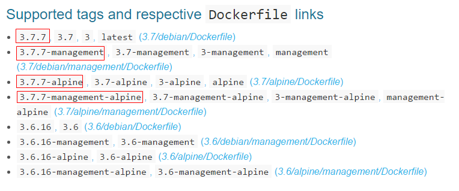
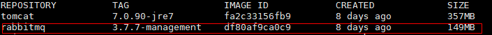
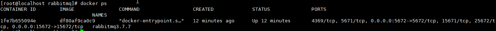
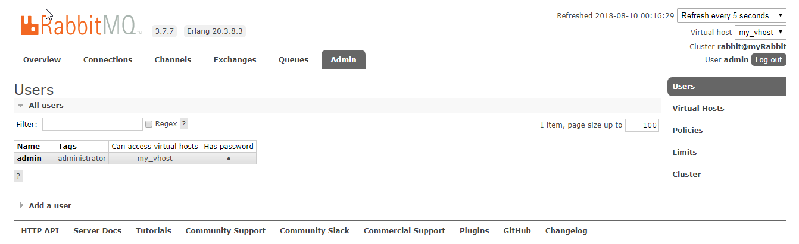

# 常用命令笔记


## 新安装的Linux安装工具组件 netstat等

```shell
yum install net-tools
```

## 查看ip地址

```shell
ip -add
```

## 安装yum

```shell
sudo yum install -y yum-utils
```

> 鉴于国内网络问题，强烈建议使用国内源，官方源请在注释中查看。
>
> 执行下面的命令添加 `yum` 软件源：
>
> ```shell
> $ sudo yum-config-manager \
>     --add-repo \
>     https://mirrors.aliyun.com/docker-ce/linux/centos/docker-ce.repo
> 
> $ sudo sed -i 's/download.docker.com/mirrors.aliyun.com\/docker-ce/g' /etc/yum.repos.d/docker-ce.repo
> 
> # 官方源
> # $ sudo yum-config-manager \
> #     --add-repo \
> #     https://download.docker.com/linux/centos/docker-ce.repo
> ```
>
> 

## 查看主机目前正在启动的服务IP：Port

```shell
netstat -napt
```

## centos7查看网卡信息

```shell
ip a
```

## 查看防火墙是否开启

```shell
systemctl status firewalld
```

## 开启防火墙

```shell
systemctl start firewalld  #关闭则start改为stop
```

## 查看所有开启的端口

```shell
firewall-cmd --list-ports
```

## 防火墙开启端口访问

```shell
firewall-cmd --zone=public --add-port=80/tcp --permanent

firewall-cmd --reload
```

> 命令含义：  --zone #作用域    --add-port=80/tcp #添加端口，格式为：端口/通讯协议    --permanent #永久生效，没有此参数重启后失效
> 注：开启后需要重启防火墙才生效，【重启命令】：

## 防火墙关闭端口

```shell
firewall-cmd --zone=public --remove-port=80/tcp --permanent
firewall-cmd --reload
```

## 安装java环境

yum方式下载安装
1、查找java相关的列表

```shell
yum -y list java*
```

或者

```shell
yum search jdk
```

2、安装jdk

```shell
yum install java-1.8.0-openjdk.x86_64
```

3、完成安装后验证

```shell
java -version
```

4、通过yum安装的默认路径为：`/usr/lib/jvm`

5、将jdk的安装路径加入到JAVA_HOME

```shell
sudo vim /etc/profile
```

在文件最后加入：

```shell
#set java environment
JAVA_HOME=/usr/lib/jvm/jre-1.8.0-openjdk-1.8.0.352.b08-2.el7_9.x86_64 # 这个值以实际为准，具体查看/usr/lib/jvm/目录下自己的jre
PATH=$PATH:$JAVA_HOME/bin
CLASSPATH=.:$JAVA_HOME/lib/dt.jar:$JAVA_HOME/lib/tools.jar
export JAVA_HOME CLASSPATH PATH
```

修改/etc/profile之后让其生效

`source /etc/profile` （注意 source 之后应有一个空格）

## 安装wget命令

```shell
sudo yum -y install wget
```

## 发送http请求

```shell
curl -i "http://www.baidu.com"
```

一、get请求：

　　1、使用curl命令：

```shell
curl "http://www.baidu.com" #如果这里的URL指向的是一个文件或者一幅图都可以直接下载到本地

curl -i "http://www.baidu.com" #显示全部信息

curl -l "http://www.baidu.com" #只显示头部信息

curl -v "http://www.baidu.com" #显示get请求全过程解析
```

　　2、使用wget命令：

```shell
　　wget "http://www.baidu.com" 也可以
```

二、post请求

　　1、使用curl命令（通过-d参数，把访问参数放在里面）：

```shell
curl -d "param1=value1¶m2=value2" "http://www.baidu.com"
```

　　2、使用wget命令：（--post-data参数来实现）

```shell
　　wget --post-data 'user=foo&password=bar' http://www.baidu.com
```

　　以上就是Linux模拟Http的get或post请求的方法了，这样一来Linux系统也能向远程服务器发送消息了。  

```shell
   示例：wget --post-data=""  http://mcs-inner.99bill.com/mcs-gateway/mcs/task/clear
```


三、curl (可直接发送格式化请求例如json)

```shell
 示例：目标url:http://fsc-inner.99bill.com/acs/deposit/{srcRef}

 命令：curl -H "Content-type: application/json" -X POST -d '{"srcRef":"1002"}'http://fsc-inner.99bill.com/acs/deposit/1002
```


## 安装zookeeper

> ***前提：由于zookeeper是使用java语言开发的，所以，在安装zookeeper之前务必先在本机安装配置好java环境！***

```shell
wget https://archive.apache.org/dist/zookeeper/zookeeper-3.4.9/zookeeper-3.4.9.tar.gz
```

解压

```shell
tar -zxvf zookeeper-3.4.9.tar.gz
```

```shell
[sanshi@localhost myproject]$ ll
drwxr-xr-x. 10 sanshi  sanshi      4096 Aug 23  2016 zookeeper-3.4.9
-rw-rw-r--.  1 sanshi  sanshi  22724574 Sep  3  2016 zookeeper-3.4.9.tar.gz
```

3，配置conf文件

```shell
[sanshi@localhost zookeeper-3.4.9]$ ls
bin        CHANGES.txt  contrib     docs             ivy.xml  LICENSE.txt  README_packaging.txt  recipes  zookeeper-3.4.9.jar      zookeeper-3.4.9.jar.md5
build.xml  conf         dist-maven  ivysettings.xml  lib      NOTICE.txt   README.txt            src      zookeeper-3.4.9.jar.asc  zookeeper-3.4.9.jar.sha1
[sanshi@localhost zookeeper-3.4.9]$ cd conf/
[sanshi@localhost conf]$ ls
configuration.xsl  log4j.properties  zoo_sample.cfg
[sanshi@localhost conf]$ cp zoo_sample.cfg zoo.cfg
[sanshi@localhost conf]$ vim zoo.cfg 
```

> 可以看到这里有个zoookeeper给我们的一个样例配置文件：zoo_sample.cfg，我们在配置我们自己的zk时，需要做的就是将这个文件复制一份，并命名为：zoo.cfg，然后在zoo.cfg中修改自己的配置即可。

zoo.cfg的相关配置项其实并不多，这边各个配置项的详细说明如下：

```shell
# zookeeper内部的基本单位，单位是毫秒，这个表示一个tickTime为2000毫秒，在zookeeper的其他配置中，都是基于tickTime来做换算的
tickTime=2000

#集群中的follower服务器(F)与leader服务器(L)之间 初始连接 时能容忍的最多心跳数（tickTime的数量）。
initLimit=10

#syncLimit：集群中的follower服务器(F)与leader服务器(L)之间 请求和应答 之间能容忍的最多心跳数（tickTime的数量）
syncLimit=5

# 数据存放文件夹，zookeeper运行过程中有两个数据需要存储，一个是快照数据（持久化数据）另一个是事务日志
dataDir=/tmp/zookeeper

# 客户端访问端口
clientPort=2181

```

4，配置环境变量

```shell
sudo vim /etc/profile

# 文件末尾追加zookeeper相关配置
export ZOOKEEPER_HOME=/home/sanshi/myproject/zookeeper-3.4.9 #这里设置解压的zk目录
export PATH=$ZOOKEEPER_HOME/bin:$PATH
export PATH
```

配置生效

```shell
[sanshi@localhost zookeeper-3.4.9]$ source /etc/profile
```

5，启动服务

```shell
[sanshi@localhost ~]$ zkServer.sh start
ZooKeeper JMX enabled by default
Using config: /home/sanshi/myproject/zookeeper-3.4.9/bin/../conf/zoo.cfg
Starting zookeeper ... STARTED
```

如果启动失败可以使用,使用这个命令启动[zookeeper](https://so.csdn.net/so/search?q=zookeeper&spm=1001.2101.3001.7020)可以查看错误信息

```shell
zkServer.sh start-foreground
```

查看启动状态

```shell
[sanshi@localhost ~]$ zkServer.sh status
ZooKeeper JMX enabled by default
Using config: /home/sanshi/myproject/zookeeper-3.4.9/bin/../conf/zoo.cfg
Mode: standalone
```

6，客户端连接

```shell
[sanshi@localhost ~]$ zkCli.sh
Connecting to localhost:2181
2022-12-26 22:32:17,137 [myid:] - INFO  [main:Environment@100] - Client environment:zookeeper.version=3.4.9-1757313, built on 08/23/2016 06:50 GMT
2022-12-26 22:32:17,139 [myid:] - INFO  [main:Environment@100] - Client environment:host.name=localhost
2022-12-26 22:32:17,139 [myid:] - INFO  [main:Environment@100] - Client environment:java.version=1.8.0_352
2022-12-26 22:32:17,140 [myid:] - INFO  [main:Environment@100] - Client environment:java.vendor=Red Hat, Inc.
2022-12-26 22:32:17,140 [myid:] - INFO  [main:Environment@100] - Client environment:java.home=/usr/lib/jvm/java-1.8.0-openjdk-1.8.0.352.b08-2.el7_9.x86_64/jre
2022-12-26 22:32:17,140 [myid:] - INFO  [main:Environment@100] - Client environment:java.class.path=/home/sanshi/myproject/zookeeper-3.4.9/bin/../build/classes:/home/sanshi/myproject/zookeeper-3.4.9/bin/../build/lib/*.jar:/home/sanshi/myproject/zookeeper-3.4.9/bin/../lib/slf4j-log4j12-1.6.1.jar:/home/sanshi/myproject/zookeeper-3.4.9/bin/../lib/slf4j-api-1.6.1.jar:/home/sanshi/myproject/zookeeper-3.4.9/bin/../lib/netty-3.10.5.Final.jar:/home/sanshi/myproject/zookeeper-3.4.9/bin/../lib/log4j-1.2.16.jar:/home/sanshi/myproject/zookeeper-3.4.9/bin/../lib/jline-0.9.94.jar:/home/sanshi/myproject/zookeeper-3.4.9/bin/../zookeeper-3.4.9.jar:/home/sanshi/myproject/zookeeper-3.4.9/bin/../src/java/lib/*.jar:/home/sanshi/myproject/zookeeper-3.4.9/bin/../conf:.:/usr/lib/jvm/jre-1.8.0-openjdk-1.8.0.352.b08-2.el7_9.x86_64/lib/dt.jar:/usr/lib/jvm/jre-1.8.0-openjdk-1.8.0.352.b08-2.el7_9.x86_64/lib/tools.jar
2022-12-26 22:32:17,140 [myid:] - INFO  [main:Environment@100] - Client environment:java.library.path=/usr/java/packages/lib/amd64:/usr/lib64:/lib64:/lib:/usr/lib
2022-12-26 22:32:17,141 [myid:] - INFO  [main:Environment@100] - Client environment:java.io.tmpdir=/tmp
2022-12-26 22:32:17,141 [myid:] - INFO  [main:Environment@100] - Client environment:java.compiler=<NA>
2022-12-26 22:32:17,141 [myid:] - INFO  [main:Environment@100] - Client environment:os.name=Linux
2022-12-26 22:32:17,141 [myid:] - INFO  [main:Environment@100] - Client environment:os.arch=amd64
2022-12-26 22:32:17,141 [myid:] - INFO  [main:Environment@100] - Client environment:os.version=3.10.0-1160.el7.x86_64
2022-12-26 22:32:17,141 [myid:] - INFO  [main:Environment@100] - Client environment:user.name=sanshi
2022-12-26 22:32:17,141 [myid:] - INFO  [main:Environment@100] - Client environment:user.home=/home/sanshi
2022-12-26 22:32:17,141 [myid:] - INFO  [main:Environment@100] - Client environment:user.dir=/home/sanshi
2022-12-26 22:32:17,141 [myid:] - INFO  [main:ZooKeeper@438] - Initiating client connection, connectString=localhost:2181 sessionTimeout=30000 watcher=org.apache.zookeeper.ZooKeeperMain$MyWatcher@5ce65a89
Welcome to ZooKeeper!
2022-12-26 22:32:17,155 [myid:] - INFO  [main-SendThread(localhost:2181):ClientCnxn$SendThread@1032] - Opening socket connection to server localhost/0:0:0:0:0:0:0:1:2181. Will not attempt to authenticate using SASL (unknown error)
JLine support is enabled
2022-12-26 22:32:17,226 [myid:] - INFO  [main-SendThread(localhost:2181):ClientCnxn$SendThread@876] - Socket connection established to localhost/0:0:0:0:0:0:0:1:2181, initiating session
2022-12-26 22:32:17,245 [myid:] - INFO  [main-SendThread(localhost:2181):ClientCnxn$SendThread@1299] - Session establishment complete on server localhost/0:0:0:0:0:0:0:1:2181, sessionid = 0x185519f7e850000, negotiated timeout = 30000

WATCHER::

WatchedEvent state:SyncConnected type:None path:null
```

7.开启对外端口


## Docker安装RabbitMq

[     docker 安装rabbitMQ      ](https://www.cnblogs.com/yufeng218/p/9452621.html)

1、进入docker hub镜像仓库地址：https://hub.docker.com/

2、搜索rabbitMq，进入官方的镜像，可以看到以下几种类型的镜像；我们选择带有“mangement”的版本（**包含web管理页面**）；



3、拉取镜像

```sh
docker pull rabbitmq:3.7.7-management
```

使用：docker images 查看所有镜像



 4、根据下载的镜像创建和启动容器

```shell
docker run -d --name rabbitmq3.7.7 -p 5672:5672 -p 15672:15672 -v `pwd`/data:/var/lib/rabbitmq --hostname myRabbit -e RABBITMQ_DEFAULT_VHOST=my_vhost  -e RABBITMQ_DEFAULT_USER=admin -e RABBITMQ_DEFAULT_PASS=admin df80af9ca0c9
```

说明：

-d 后台运行容器；

--name 指定容器名；

-p 指定服务运行的端口（5672：应用访问端口；15672：控制台Web端口号）；

-v 映射目录或文件；

--hostname  主机名（RabbitMQ的一个重要注意事项是它根据所谓的 “节点名称” 存储数据，默认为主机名）；

-e 指定环境变量；（RABBITMQ_DEFAULT_VHOST：默认虚拟机名；RABBITMQ_DEFAULT_USER：默认的用户名；RABBITMQ_DEFAULT_PASS：默认用户名的密码）

5、使用命令：docker ps 查看正在运行容器



6、可以使用浏览器打开web管理端：http://Server-IP:15672




## Docker

### 安装docker

[🚀🚀🚀🚀Docker — 从入门到实践](https://yeasy.gitbook.io/docker_practice/)

#### 卸载旧版本

旧版本的 Docker 称为 `docker` 或者 `docker-engine`，使用以下命令卸载旧版本：

```shell
$ sudo yum remove docker \
                  docker-client \
                  docker-client-latest \
                  docker-common \
                  docker-latest \
                  docker-latest-logrotate \
                  docker-logrotate \
                  docker-selinux \
                  docker-engine-selinux \
                  docker-engine
```

#### 使用 yum 安装Docker

```shell
sudo yum install docker-ce docker-ce-cli containerd.io
```

#### CentOS8 额外设置

由于 CentOS8 防火墙使用了 `nftables`，但 Docker 尚未支持 `nftables`， 我们可以使用如下设置使用 `iptables`：

更改 `/etc/firewalld/firewalld.conf`

```
# FirewallBackend=nftables
FirewallBackend=iptables
```

或者执行如下命令：

```
$ firewall-cmd --permanent --zone=trusted --add-interface=docker0
$ firewall-cmd --reload
```

#### 使用脚本自动安装

在测试或开发环境中 Docker 官方为了简化安装流程，提供了一套便捷的安装脚本，CentOS 系统上可以使用这套脚本安装，另外可以通过 `--mirror` 选项使用国内源进行安装：

> 若你想安装测试版的 Docker, 请从 test.docker.com 获取脚本

```shell
# $ curl -fsSL test.docker.com -o get-docker.sh
curl -fsSL get.docker.com -o get-docker.sh
sudo sh get-docker.sh --mirror Aliyun
# $ sudo sh get-docker.sh --mirror AzureChinaCloud
```

#### 启动 Docker

```shell
sudo systemctl enable docker
sudo systemctl start docker
```

#### 建立 docker 用户组

默认情况下，`docker` 命令会使用 [Unix socket](https://en.wikipedia.org/wiki/Unix_domain_socket) 与 Docker 引擎通讯。而只有 `root` 用户和 `docker` 组的用户才可以访问 Docker 引擎的 Unix socket。出于安全考虑，一般 Linux 系统上不会直接使用 `root` 用户。因此，更好地做法是将需要使用 `docker` 的用户加入 `docker` 用户组。

建立 `docker` 组：

```shell
sudo groupadd docker
```

将当前用户加入 `docker` 组：

```shell
sudo usermod -aG docker $USER
```

> 退出当前终端并重新登录，进行如下测试。

#### 测试 Docker 是否安装正确

```shell
docker run --rm hello-world
```

### 使用镜像

#### 获取镜像

> 之前提到过，[Docker Hub](https://hub.docker.com/search?q=&type=image) 上有大量的高质量的镜像可以用，这里我们就说一下怎么获取这些镜像。
>
> 从 Docker 镜像仓库获取镜像的命令是 `docker pull`。其命令格式为：

```shell
docker pull [选项] [Docker Registry 地址[:端口号]/]仓库名[:标签]
```

> 具体的选项可以通过 `docker pull --help` 命令看到，这里我们说一下镜像名称的格式。
>
> Docker 镜像仓库地址：地址的格式一般是 `<域名/IP>[:端口号]`。默认地址是 Docker Hub(`docker.io`)。
>
> 仓库名：如之前所说，这里的仓库名是两段式名称，即 `<用户名>/<软件名>`。对于 Docker Hub，如果不给出用户名，则默认为 `library`，也就是官方镜像。

> ```shell
> docker pull ubuntu:18.04
> 18.04: Pulling from library/ubuntu
> 92dc2a97ff99: Pull complete
> be13a9d27eb8: Pull complete
> c8299583700a: Pull complete
> Digest: sha256:4bc3ae6596938cb0d9e5ac51a1152ec9dcac2a1c50829c74abd9c4361e321b26
> Status: Downloaded newer image for ubuntu:18.04
> docker.io/library/ubuntu:18.04
> ```
>
> 上面的命令中没有给出 Docker 镜像仓库地址，因此将会从 Docker Hub （`docker.io`）获取镜像。而镜像名称是 `ubuntu:18.04`，因此将会获取官方镜像 `library/ubuntu` 仓库中标签为 `18.04` 的镜像。`docker pull` 命令的输出结果最后一行给出了镜像的完整名称，即： `docker.io/library/ubuntu:18.04`。
>
> 从下载过程中可以看到我们之前提及的分层存储的概念，镜像是由多层存储所构成。**下载也是一层层的去下载，并非单一文件。下载过程中给出了每一层的 ID 的前 12 位。**并且下载结束后，给出该镜像完整的 `sha256` 的摘要，以确保下载一致性。
>
> 在使用上面命令的时候，你可能会发现，你所看到的层 ID 以及 `sha256` 的摘要和这里的不一样。这是因为官方镜像是一直在维护的，有任何新的 bug，或者版本更新，都会进行修复再以原来的标签发布，这样可以确保任何使用这个标签的用户可以获得更安全、更稳定的镜像。

##### 运行

有了镜像后，我们就能够以这个镜像为基础启动并运行一个容器。以上面的 `ubuntu:18.04` 为例，如果我们打算启动里面的 `bash` 并且进行交互式操作的话，可以执行下面的命令。

```shell
docker run -it --rm ubuntu:18.04 bash

root@e7009c6ce357:/# cat /etc/os-release
NAME="Ubuntu"
VERSION="18.04.1 LTS (Bionic Beaver)"
ID=ubuntu
ID_LIKE=debian
PRETTY_NAME="Ubuntu 18.04.1 LTS"
VERSION_ID="18.04"
HOME_URL="https://www.ubuntu.com/"
SUPPORT_URL="https://help.ubuntu.com/"
BUG_REPORT_URL="https://bugs.launchpad.net/ubuntu/"
PRIVACY_POLICY_URL="https://www.ubuntu.com/legal/terms-and-policies/privacy-policy"
VERSION_CODENAME=bionic
UBUNTU_CODENAME=bionic
```

> `docker run` 就是运行容器的命令，具体格式我们会在 [容器]() 一节进行详细讲解，我们这里简要的说明一下上面用到的参数。
>
> `-it`：这是两个参数，一个是 `-i`：交互式操作，一个是 `-t` 终端。我们这里打算进入 `bash` 执行一些命令并查看返回结果，因此我们需要交互式终端。
>
> `--rm`：这个参数是说容器退出后随之将其删除。默认情况下，为了排障需求，退出的容器并不会立即删除，除非手动 `docker rm`。我们这里只是随便执行个命令，看看结果，不需要排障和保留结果，因此使用 `--rm` 可以避免浪费空间。
>
> `ubuntu:18.04`：这是指用 `ubuntu:18.04` 镜像为基础来启动容器。
>
> `bash`：放在镜像名后的是 **命令**，这里我们希望有个交互式 Shell，因此用的是 `bash`。

进入容器后，我们可以在 Shell 下操作，执行任何所需的命令。这里，我们执行了 `cat /etc/os-release`，这是 Linux 常用的查看当前系统版本的命令，从返回的结果可以看到容器内是 `Ubuntu 18.04.1 LTS` 系统。

最后我们通过 `exit` 退出了这个容器。

#### 列出镜像

要想列出已经下载下来的镜像，可以使用 `docker image ls` 命令。

```shell
$ docker image ls
REPOSITORY           TAG                 IMAGE ID            CREATED             SIZE
redis                latest              5f515359c7f8        5 days ago          183 MB
nginx                latest              05a60462f8ba        5 days ago          181 MB
mongo                3.2                 fe9198c04d62        5 days ago          342 MB
<none>               <none>              00285df0df87        5 days ago          342 MB
ubuntu               18.04               329ed837d508        3 days ago          63.3MB
ubuntu               bionic              329ed837d508        3 days ago          63.3MB
```

> 列表包含了 `仓库名`、`标签`、`镜像 ID`、`创建时间` 以及 `所占用的空间`。
>
> 其中仓库名、标签在之前的基础概念章节已经介绍过了。**镜像 ID** 则是镜像的唯一标识，一个镜像可以对应多个 **标签**。因此，在上面的例子中，我们可以看到 `ubuntu:18.04` 和 `ubuntu:bionic` 拥有相同的 ID，因为它们对应的是同一个镜像

##### 镜像体积

如果仔细观察，会注意到，这里标识的所占用空间和在 Docker Hub 上看到的镜像大小不同。比如，`ubuntu:18.04` 镜像大小，在这里是 `63.3MB`，但是在 [Docker Hub](https://hub.docker.com/layers/ubuntu/library/ubuntu/bionic/images/sha256-32776cc92b5810ce72e77aca1d949de1f348e1d281d3f00ebcc22a3adcdc9f42?context=explore) 显示的却是 `25.47 MB`。这是因为 Docker Hub 中显示的体积是压缩后的体积。在镜像下载和上传过程中镜像是保持着压缩状态的，因此 Docker Hub 所显示的大小是网络传输中更关心的流量大小。而 `docker image ls` 显示的是镜像下载到本地后，展开的大小，准确说，是展开后的各层所占空间的总和，因为镜像到本地后，查看空间的时候，更关心的是本地磁盘空间占用的大小。

另外一个需要注意的问题是，`docker image ls` 列表中的镜像体积总和并非是所有镜像实际硬盘消耗。由于 Docker 镜像是多层存储结构，并且可以继承、复用，因此不同镜像可能会因为使用相同的基础镜像，从而拥有共同的层。由于 Docker 使用 Union FS，相同的层只需要保存一份即可，因此实际镜像硬盘占用空间很可能要比这个列表镜像大小的总和要小的多。

你可以通过 `docker system df` 命令来便捷的查看镜像、容器、数据卷所占用的空间

```shell
$ docker system df

TYPE                TOTAL               ACTIVE              SIZE                RECLAIMABLE
Images              24                  0                   1.992GB             1.992GB (100%)
Containers          1                   0                   62.82MB             62.82MB (100%)
Local Volumes       9                   0                   652.2MB             652.2MB (100%)
Build Cache                                                 0B                  0B
```

##### 虚悬镜像

上面的镜像列表中，还可以看到一个特殊的镜像，这个镜像既没有仓库名，也没有标签，均为 `<none>`。：

```shell
<none>               <none>              00285df0df87        5 days ago          342 MB
```

这个镜像原本是有镜像名和标签的，原来为 `mongo:3.2`，随着官方镜像维护，发布了新版本后，重新 `docker pull mongo:3.2` 时，`mongo:3.2` 这个镜像名被转移到了新下载的镜像身上，而旧的镜像上的这个名称则被取消，从而成为了 `<none>`。除了 `docker pull` 可能导致这种情况，`docker build` 也同样可以导致这种现象。由于新旧镜像同名，旧镜像名称被取消，从而出现仓库名、标签均为 `<none>` 的镜像。这类无标签镜像也被称为 **虚悬镜像(dangling image)** ，可以用下面的命令专门显示这类镜像：

```shell
$ docker image ls -f dangling=true
REPOSITORY          TAG                 IMAGE ID            CREATED             SIZE
<none>              <none>              00285df0df87        5 days ago          342 MB
```

一般来说，虚悬镜像已经失去了存在的价值，是可以随意删除的，可以用下面的命令删除。

```shell
$ docker image prune
```

##### 中间层镜像

为了加速镜像构建、重复利用资源，Docker 会利用 **中间层镜像**。所以在使用一段时间后，可能会看到一些依赖的中间层镜像。默认的 `docker image ls` 列表中只会显示顶层镜像，如果希望显示包括中间层镜像在内的所有镜像的话，需要加 `-a` 参数。

```shell
$ docker image ls -a
```

这样会看到很多无标签的镜像，与之前的虚悬镜像不同，这些无标签的镜像很多都是中间层镜像，是其它镜像所依赖的镜像。这些无标签镜像不应该删除，否则会导致上层镜像因为依赖丢失而出错。实际上，这些镜像也没必要删除，因为之前说过，相同的层只会存一遍，而这些镜像是别的镜像的依赖，因此并不会因为它们被列出来而多存了一份，无论如何你也会需要它们。只要删除那些依赖它们的镜像后，这些依赖的中间层镜像也会被连带删除。

##### 列出部分镜像

不加任何参数的情况下，`docker image ls` 会列出所有顶层镜像，但是有时候我们只希望列出部分镜像。`docker image ls` 有好几个参数可以帮助做到这个事情。

根据仓库名列出镜像

```shell
$ docker image ls ubuntu
REPOSITORY          TAG                 IMAGE ID            CREATED             SIZE
ubuntu              18.04               329ed837d508        3 days ago          63.3MB
ubuntu              bionic              329ed837d508        3 days ago          63.3MB
```

列出特定的某个镜像，也就是说指定仓库名和标签

```shell
$ docker image ls ubuntu:18.04
REPOSITORY          TAG                 IMAGE ID            CREATED             SIZE
ubuntu              18.04               329ed837d508        3 days ago          63.3MB
```

除此以外，`docker image ls` 还支持强大的过滤器参数 `--filter`，或者简写 `-f`。之前我们已经看到了使用过滤器来列出虚悬镜像的用法，它还有更多的用法。比如，我们希望看到在 `mongo:3.2` 之后建立的镜像，可以用下面的命令：

```shell
$ docker image ls -f since=mongo:3.2
REPOSITORY          TAG                 IMAGE ID            CREATED             SIZE
redis               latest              5f515359c7f8        5 days ago          183 MB
nginx               latest              05a60462f8ba        5 days ago          181 MB
```

想查看某个位置之前的镜像也可以，只需要把 `since` 换成 `before` 即可。

此外，如果镜像构建时，定义了 `LABEL`，还可以通过 `LABEL` 来过滤。

```shell
$ docker image ls -f label=com.example.version=0.1
...
```

##### 以特定格式显示

默认情况下，`docker image ls` 会输出一个完整的表格，但是我们并非所有时候都会需要这些内容。比如，刚才删除虚悬镜像的时候，我们需要利用 `docker image ls` 把所有的虚悬镜像的 ID 列出来，然后才可以交给 `docker image rm` 命令作为参数来删除指定的这些镜像，这个时候就用到了 `-q` 参数。

```shell
$ docker image ls -q
5f515359c7f8
05a60462f8ba
fe9198c04d62
00285df0df87
329ed837d508
329ed837d508
```

`--filter` 配合 `-q` 产生出指定范围的 ID 列表，然后送给另一个 `docker` 命令作为参数，从而针对这组实体成批的进行某种操作的做法在 Docker 命令行使用过程中非常常见，不仅仅是镜像，将来我们会在各个命令中看到这类搭配以完成很强大的功能。因此每次在文档看到过滤器后，可以多注意一下它们的用法。

另外一些时候，我们可能只是对表格的结构不满意，希望自己组织列；或者不希望有标题，这样方便其它程序解析结果等，这就用到了 [Go 的模板语法](https://gohugo.io/templates/introduction/)。

比如，下面的命令会直接列出镜像结果，并且只包含镜像ID和仓库名：

```shell
$ docker image ls --format "{{.ID}}: {{.Repository}}"
5f515359c7f8: redis
05a60462f8ba: nginx
fe9198c04d62: mongo
00285df0df87: <none>
329ed837d508: ubuntu
329ed837d508: ubuntu
```

或者打算以表格等距显示，并且有标题行，和默认一样，不过自己定义列：

```shell
$ docker image ls --format "table {{.ID}}\t{{.Repository}}\t{{.Tag}}"
IMAGE ID            REPOSITORY          TAG
5f515359c7f8        redis               latest
05a60462f8ba        nginx               latest
fe9198c04d62        mongo               3.2
00285df0df87        <none>              <none>
329ed837d508        ubuntu              18.04
329ed837d508        ubuntu              bionic
```

#### 删除本地镜像

如果要删除本地的镜像，可以使用 `docker image rm` 命令，其格式为：

```shell
$ docker image rm [选项] <镜像1> [<镜像2> ...]
```

##### 用 ID、镜像名、摘要删除镜像

其中，`<镜像>` 可以是 `镜像短 ID`、`镜像长 ID`、`镜像名` 或者 `镜像摘要`。

比如我们有这么一些镜像：

```shell
$ docker image ls
REPOSITORY                  TAG                 IMAGE ID            CREATED             SIZE
centos                      latest              0584b3d2cf6d        3 weeks ago         196.5 MB
redis                       alpine              501ad78535f0        3 weeks ago         21.03 MB
docker                      latest              cf693ec9b5c7        3 weeks ago         105.1 MB
nginx                       latest              e43d811ce2f4        5 weeks ago         181.5 MB
```

我们可以用镜像的完整 ID，也称为 `长 ID`，来删除镜像。使用脚本的时候可能会用长 ID，但是人工输入就太累了，所以更多的时候是用 `短 ID` 来删除镜像。`docker image ls` 默认列出的就已经是短 ID 了，一般取前3个字符以上，只要足够区分于别的镜像就可以了。

比如这里，如果我们要删除 `redis:alpine` 镜像，可以执行：

```shell
$ docker image rm 501
Untagged: redis:alpine
Untagged: redis@sha256:f1ed3708f538b537eb9c2a7dd50dc90a706f7debd7e1196c9264edeea521a86d
Deleted: sha256:501ad78535f015d88872e13fa87a828425117e3d28075d0c117932b05bf189b7
Deleted: sha256:96167737e29ca8e9d74982ef2a0dda76ed7b430da55e321c071f0dbff8c2899b
Deleted: sha256:32770d1dcf835f192cafd6b9263b7b597a1778a403a109e2cc2ee866f74adf23
Deleted: sha256:127227698ad74a5846ff5153475e03439d96d4b1c7f2a449c7a826ef74a2d2fa
Deleted: sha256:1333ecc582459bac54e1437335c0816bc17634e131ea0cc48daa27d32c75eab3
Deleted: sha256:4fc455b921edf9c4aea207c51ab39b10b06540c8b4825ba57b3feed1668fa7c7
```

我们也可以用`镜像名`，也就是 `<仓库名>:<标签>`，来删除镜像。

```shell
$ docker image rm centos
Untagged: centos:latest
Untagged: centos@sha256:b2f9d1c0ff5f87a4743104d099a3d561002ac500db1b9bfa02a783a46e0d366c
Deleted: sha256:0584b3d2cf6d235ee310cf14b54667d889887b838d3f3d3033acd70fc3c48b8a
Deleted: sha256:97ca462ad9eeae25941546209454496e1d66749d53dfa2ee32bf1faabd239d38
```

### 操作容器

> 容器是 Docker 又一核心概念。
>
> 简单的说，容器是独立运行的一个或一组应用，以及它们的运行态环境。对应的，虚拟机可以理解为模拟运行的一整套操作系统（提供了运行态环境和其他系统环境）和跑在上面的应用。
>
> 本章将具体介绍如何来管理一个容器，包括创建、启动和停止等。

#### 启动

> 启动容器有两种方式，一种是基于镜像新建一个容器并启动，另外一个是将在终止状态（`exited`）的容器重新启动。
>
> 因为 Docker 的容器实在太轻量级了，很多时候用户都是随时删除和新创建容器。

#### 新建并启动

所需要的命令主要为 `docker run`。

例如，下面的命令输出一个 “Hello World”，之后终止容器。

```shell
$ docker run ubuntu:18.04 /bin/echo 'Hello world'
Hello world
```

这跟在本地直接执行 `/bin/echo 'hello world'` 几乎感觉不出任何区别。

下面的命令则启动一个 bash 终端，允许用户进行交互。

> 其中，`-t` 选项让Docker分配一个伪终端（pseudo-tty）并绑定到容器的标准输入上， `-i` 则让容器的标准输入保持打开

```shell
$ docker run -t -i ubuntu:18.04 /bin/bash
root@af8bae53bdd3:/#
```

在交互模式下，用户可以通过所创建的终端来输入命令，例如

```shell
root@af8bae53bdd3:/# pwd
/
root@af8bae53bdd3:/# ls
bin boot dev etc home lib lib64 media mnt opt proc root run sbin srv sys tmp usr var
```

当利用 `docker run` 来创建容器时，Docker 在后台运行的标准操作包括：

- 检查本地是否存在指定的镜像，不存在就从 [registry]() 下载
- 利用镜像创建并启动一个容器
- 分配一个文件系统，并在只读的镜像层外面挂载一层可读写层
- 从宿主主机配置的网桥接口中桥接一个虚拟接口到容器中去
- 从地址池配置一个 ip 地址给容器
- 执行用户指定的应用程序
- 执行完毕后容器被终止

#### 启动已终止容器

可以利用 `docker container start` 命令，直接将一个已经终止（`exited`）的容器启动运行

容器的核心为所执行的应用程序，所需要的资源都是应用程序运行所必需的。除此之外，并没有其它的资源。可以在伪终端中利用 `ps` 或 `top` 来查看进程信息。

```shell
root@ba267838cc1b:/# ps
  PID TTY          TIME CMD
    1 ?        00:00:00 bash
   11 ?        00:00:00 ps
```

可见，容器中仅运行了指定的 bash 应用。这种特点使得 Docker 对资源的利用率极高，是货真价实的轻量级虚拟化。

#### 守护态运行

> 更多的时候，需要让 Docker 在后台运行而不是直接把执行命令的结果输出在当前宿主机下。此时，可以通过添加 `-d` 参数来实现。

下面举两个例子来说明一下。

如果不使用 `-d` 参数运行容器。

```shell
$ docker run ubuntu:18.04 /bin/sh -c "while true; do echo hello world; sleep 1; done"
hello world
hello world
hello world
hello world
```

容器会把输出的结果 (STDOUT) 打印到宿主机上面

如果使用了 `-d` 参数运行容器。

> 此时容器会在后台运行并不会把输出的结果 (STDOUT) 打印到宿主机上面(输出结果可以用 `docker logs` 查看)。

```shell
$ docker run -d ubuntu:18.04 /bin/sh -c "while true; do echo hello world; sleep 1; done"
77b2dc01fe0f3f1265df143181e7b9af5e05279a884f4776ee75350ea9d8017a
```

**注：** 容器是否会长久运行，是和 `docker run` 指定的命令有关，和 `-d` 参数无关。

使用 `-d` 参数启动后会返回一个唯一的 id，也可以通过 `docker container ls` 命令来查看容器信息。

```shell
$ docker container ls
CONTAINER ID  IMAGE         COMMAND               CREATED        STATUS       PORTS NAMES
77b2dc01fe0f  ubuntu:18.04  /bin/sh -c 'while tr  2 minutes ago  Up 1 minute        agitated_wright
```

要获取容器的输出信息，可以通过 `docker container logs` 命令。

```shell
$ docker container logs [container ID or NAMES]
hello world
hello world
hello world
. . .
```

#### 终止

> 可以使用 `docker container stop` 来终止一个运行中的容器。
>
> 此外，当 Docker 容器中指定的应用终结时，容器也自动终止。

例如对于上一章节中只启动了一个终端的容器，用户通过 `exit` 命令或 `Ctrl+d` 来退出终端时，所创建的容器立刻终止。

终止状态的容器可以用 `docker container ls -a` 命令看到。例如

```shell
$ docker container ls -a
CONTAINER ID        IMAGE                    COMMAND                CREATED             STATUS                          PORTS               NAMES
ba267838cc1b        ubuntu:18.04             "/bin/bash"            30 minutes ago      Exited (0) About a minute ago                       trusting_newton
```

处于终止状态的容器，可以通过 `docker container start` 命令来重新启动。

此外，`docker container restart` 命令会将一个运行态的容器终止，然后再重新启动它。

#### 进入容器

> 在使用 `-d` 参数时，容器启动后会进入后台。
>
> 某些时候需要进入容器进行操作，包括使用 `docker attach` 命令或 `docker exec` 命令，推荐大家使用 `docker exec` 命令，原因会在下面说明。

##### `attach` 命令

下面示例如何使用 `docker attach` 命令。

> *注意：* 如果从这个 stdin 中 exit，会导致容器的停止。

```shell
$ docker run -dit ubuntu
243c32535da7d142fb0e6df616a3c3ada0b8ab417937c853a9e1c251f499f550

$ docker container ls
CONTAINER ID        IMAGE               COMMAND             CREATED             STATUS              PORTS               NAMES
243c32535da7        ubuntu:latest       "/bin/bash"         18 seconds ago      Up 17 seconds                           nostalgic_hypatia

$ docker attach 243c
root@243c32535da7:/#
```

##### `exec` 命令

`-i` `-t` 参数

`docker exec` 后边可以跟多个参数，这里主要说明 `-i` `-t` 参数。

只用 `-i` 参数时，由于没有分配伪终端，界面没有我们熟悉的 Linux 命令提示符，但命令执行结果仍然可以返回。

当 `-i` `-t` 参数一起使用时，则可以看到我们熟悉的 Linux 命令提示符。

```shell
$ docker run -dit ubuntu
69d137adef7a8a689cbcb059e94da5489d3cddd240ff675c640c8d96e84fe1f6

$ docker container ls
CONTAINER ID        IMAGE               COMMAND             CREATED             STATUS              PORTS               NAMES
69d137adef7a        ubuntu:latest       "/bin/bash"         18 seconds ago      Up 17 seconds                           zealous_swirles

$ docker exec -i 69d1 bash
ls
bin
boot
dev
...

$ docker exec -it 69d1 bash
root@69d137adef7a:/#
```

##### 案例 进入redis容器操作redis

要通过命令行操作运行在Docker容器中的Redis实例，您需要使用`docker exec`命令进入Redis容器并使用Redis客户端。

下面是一个例子，假设您的Redis容器名称为`redis_container`：

1. 执行以下命令以进入Redis容器：

```shell
docker exec -it redis_container sh
```

1. 运行Redis客户端：

```shell
redis-cli
```

1. 您现在可以在命令行中使用Redis命令了，例如：

```shell
codeSET mykey "Hello World"
GET mykey
```

这将设置一个名为"mykey"的键，并将其值设置为"Hello World"，然后获取该键的值并将其打印在终端上。

1. 要退出Redis客户端，请键入以下命令：

```shell
exit
```

1. 最后，要退出Redis容器，请键入以下命令：

```shell
exit
```

请注意，在执行`docker exec`命令时，`-it`选项用于打开一个交互式的终端会话。这将使您能够与容器交互并运行命令。如果您需要从容器中退出，您需要先退出Redis客户端，然后退出容器的交互模式。

#### 导出和导入

##### 导出容器

如果要导出本地某个容器，可以使用 `docker export` 命令。

> 这样将导出容器快照到本地文件。

```shell
$ docker container ls -a
CONTAINER ID        IMAGE               COMMAND             CREATED             STATUS                    PORTS               NAMES
7691a814370e        ubuntu:18.04        "/bin/bash"         36 hours ago        Exited (0) 21 hours ago                       test
$ docker export 7691a814370e > ubuntu.tar
```

##### 导入容器快照

可以使用 `docker import` 从容器快照文件中再导入为镜像，例如

```shell
$ cat ubuntu.tar | docker import - test/ubuntu:v1.0
$ docker image ls
REPOSITORY          TAG                 IMAGE ID            CREATED              VIRTUAL SIZE
test/ubuntu         v1.0                9d37a6082e97        About a minute ago   171.3 MB
```

此外，也可以通过指定 URL 或者某个目录来导入，例如

> *注：用户既可以使用* `docker load` *来导入镜像存储文件到本地镜像库，也可以使用* `docker import` 来导入一个容器快照到本地镜像库。这两者的区别在于容器快照文件将丢弃所有的历史记录和元数据信息（即仅保存容器当时的快照状态），而镜像存储文件将保存完整记录，体积也要大。此外，从容器快照文件导入时可以重新指定标签等元数据信息。

```shell
$ docker import http://example.com/exampleimage.tgz example/imagerepo
```

#### 删除

##### 删除容器

可以使用 `docker container rm` 来删除一个处于终止状态的容器。例如

```shell
$ docker container rm trusting_newton
trusting_newton
```

如果要删除一个运行中的容器，可以添加 `-f` 参数。Docker 会发送 `SIGKILL` 信号给容器。

##### 清理所有处于终止状态的容器

用 `docker container ls -a` 命令可以查看所有已经创建的包括终止状态的容器，如果数量太多要一个个删除可能会很麻烦，用下面的命令可以清理掉所有处于终止状态的容器。

```shell
$ docker container prune
```

### 数据管理


这一章介绍如何在 Docker 内部以及容器之间管理数据，在容器中管理数据主要有两种方式：

- 数据卷（Volumes）
- 挂载主机目录 (Bind mounts)

#### 数据卷

`数据卷` 是一个可供一个或多个容器使用的特殊目录，它绕过 UFS，可以提供很多有用的特性：

> 注意：`数据卷` 的使用，类似于 Linux 下对目录或文件进行 mount，镜像中的被指定为挂载点的目录中的文件会复制到数据卷中（仅数据卷为空时会复制）

- `数据卷` 可以在容器之间共享和重用
- 对 `数据卷` 的修改会立马生效
- 对 `数据卷` 的更新，不会影响镜像
- `数据卷` 默认会一直存在，即使容器被删除

##### 创建一个数据卷

```shell
$ docker volume create my-vol
```

查看所有的 `数据卷`

```shell
$ docker volume ls

DRIVER              VOLUME NAME
local               my-vol
```

在主机里使用以下命令可以查看指定 `数据卷` 的信息

```shell
$ docker volume inspect my-vol
[
    {
        "Driver": "local",
        "Labels": {},
        "Mountpoint": "/var/lib/docker/volumes/my-vol/_data",
        "Name": "my-vol",
        "Options": {},
        "Scope": "local"
    }
]
```

##### 启动一个挂载数据卷的容器

在用 `docker run` 命令的时候，使用 `--mount` 标记来将 `数据卷` 挂载到容器里。在一次 `docker run` 中可以挂载多个 `数据卷`。

下面创建一个名为 `web` 的容器，并加载一个 `数据卷` 到容器的 `/usr/share/nginx/html` 目录。

```shell
$ docker run -d -P \
    --name web \
    # -v my-vol:/usr/share/nginx/html \
    --mount source=my-vol,target=/usr/share/nginx/html \
    nginx:alpine
```

##### 查看数据卷的具体信息

在主机里使用以下命令可以查看 `web` 容器的信息

```shell
$ docker inspect web
```

`数据卷` 信息在 "Mounts" Key 下面

```shell
"Mounts": [
    {
        "Type": "volume",
        "Name": "my-vol",
        "Source": "/var/lib/docker/volumes/my-vol/_data",
        "Destination": "/usr/share/nginx/html",
        "Driver": "local",
        "Mode": "",
        "RW": true,
        "Propagation": ""
    }
],
```

##### 删除数据卷

```shell
$ docker volume rm my-vol
```

`数据卷` 是被设计用来持久化数据的，它的生命周期独立于容器，Docker 不会在容器被删除后自动删除 `数据卷`，并且也不存在垃圾回收这样的机制来处理没有任何容器引用的 `数据卷`。如果需要在删除容器的同时移除数据卷。可以在删除容器的时候使用 `docker rm -v` 这个命令。

无主的数据卷可能会占据很多空间，要清理请使用以下命令

```shell
$ docker volume prune
```

#### 挂载主机目录

##### 挂载一个主机目录作为数据卷

使用 `--mount` 标记可以指定挂载一个本地主机的目录到容器中去。

```shell
$ docker run -d -P \
    --name web \
    # -v /src/webapp:/usr/share/nginx/html \
    --mount type=bind,source=/src/webapp,target=/usr/share/nginx/html \
    nginx:alpine
```

上面的命令加载主机的 `/src/webapp` 目录到容器的 `/usr/share/nginx/html`目录。这个功能在进行测试的时候十分方便，比如用户可以放置一些程序到本地目录中，来查看容器是否正常工作。本地目录的路径必须是绝对路径，以前使用 `-v` 参数时如果本地目录不存在 Docker 会自动为你创建一个文件夹，现在使用 `--mount` 参数时如果本地目录不存在，Docker 会报错。

Docker 挂载主机目录的默认权限是 `读写`，用户也可以通过增加 `readonly` 指定为 `只读`。

```shell
$ docker run -d -P \
    --name web \
    # -v /src/webapp:/usr/share/nginx/html:ro \
    --mount type=bind,source=/src/webapp,target=/usr/share/nginx/html,readonly \
    nginx:alpine
```

加了 `readonly` 之后，就挂载为 `只读` 了。如果你在容器内 `/usr/share/nginx/html` 目录新建文件，会显示如下错误

```shell
/usr/share/nginx/html # touch new.txt
touch: new.txt: Read-only file system
```

##### 查看数据卷的具体信息

在主机里使用以下命令可以查看 `web` 容器的信息

```shell
$ docker inspect web
```

`挂载主机目录` 的配置信息在 "Mounts" Key 下面

```shell
"Mounts": [
    {
        "Type": "bind",
        "Source": "/src/webapp",
        "Destination": "/usr/share/nginx/html",
        "Mode": "",
        "RW": true,
        "Propagation": "rprivate"
    }
],
```

##### 挂载一个本地主机文件作为数据卷

`--mount` 标记也可以从主机挂载单个文件到容器中

```shell
$ docker run --rm -it \
   # -v $HOME/.bash_history:/root/.bash_history \
   --mount type=bind,source=$HOME/.bash_history,target=/root/.bash_history \
   ubuntu:18.04 \
   bash

root@2affd44b4667:/# history
1  ls
2  diskutil list
```

这样就可以记录在容器输入过的命令了


## 使用网络

> Docker 允许通过外部访问容器或容器互联的方式来提供网络服务。

### 外部访问容器

容器中可以运行一些网络应用，要让外部也可以访问这些应用，可以通过 `-P` 或 `-p` 参数来指定端口映射。

当使用 `-P` 标记时，Docker 会随机映射一个端口到内部容器开放的网络端口。

使用 `docker container ls` 可以看到，本地主机的 32768 被映射到了容器的 80 端口。此时访问本机的 32768 端口即可访问容器内 NGINX 默认页面。

```shell
$ docker run -d -P nginx:alpine

$ docker container ls -l
CONTAINER ID        IMAGE               COMMAND                  CREATED             STATUS              PORTS                   NAMES
fae320d08268        nginx:alpine        "/docker-entrypoint.…"   24 seconds ago      Up 20 seconds       0.0.0.0:32768->80/tcp   bold_mcnulty
```

同样的，可以通过 `docker logs` 命令来查看访问记录。

```shell
$ docker logs fa
172.17.0.1 - - [25/Aug/2020:08:34:04 +0000] "GET / HTTP/1.1" 200 612 "-" "Mozilla/5.0 (Windows NT 10.0; Win64; x64; rv:80.0) Gecko/20100101 Firefox/80.0" "-"
```

`-p` 则可以指定要映射的端口，并且，在一个指定端口上只可以绑定一个容器。支持的格式有 

`ip:hostPort:containerPort | ip::containerPort | hostPort:containerPort`。

#### 映射所有接口地址

使用 `hostPort:containerPort` 格式本地的 80 端口映射到容器的 80 端口，可以执行

> 此时默认会绑定本地所有接口上的所有地址。

```shell
$ docker run -d -p 80:80 nginx:alpine
```

#### 映射到指定地址的指定端口

可以使用 `ip:hostPort:containerPort` 格式指定映射使用一个特定地址，比如 localhost 地址 127.0.0.1

```shell
$ docker run -d -p 127.0.0.1:80:80 nginx:alpine
```

#### 映射到指定地址的任意端

使用 `ip::containerPort` 绑定 localhost 的任意端口到容器的 80 端口，本地主机会自动分配一个端口。

```shell
$ docker run -d -p 127.0.0.1::80 nginx:alpine
```

还可以使用 `udp` 标记来指定 `udp` 端口

```shell
$ docker run -d -p 127.0.0.1:80:80/udp nginx:alpine
```

#### 查看映射端口配置

使用 `docker port` 来查看当前映射的端口配置，也可以查看到绑定的地址

```shell
$ docker port fa 80
0.0.0.0:32768
```

> 注意：
>
> - 容器有自己的内部网络和 ip 地址（使用 `docker inspect` 查看，Docker 还可以有一个可变的网络配置。）
> - `-p` 标记可以多次使用来绑定多个端口

例如

```shell
$ docker run -d \
    -p 80:80 \
    -p 443:443 \
    nginx:alpine
```

### 容器互联

> 如果你之前有 `Docker` 使用经验，你可能已经习惯了使用 `--link` 参数来使容器互联。
>
> 随着 Docker 网络的完善，强烈建议大家将容器加入自定义的 Docker 网络来连接多个容器，而不是使用 `--link` 参数。

#### 新建网络

下面先创建一个新的 Docker 网络。

```shell
$ docker network create -d bridge my-net
```

`-d` 参数指定 Docker 网络类型，有 `bridge` `overlay`。其中 `overlay` 网络类型用于 [Swarm mode]()，在本小节中你可以忽略它。

#### 连接容器

运行一个容器并连接到新建的 `my-net` 网络

```shell
$ docker run -it --rm --name busybox1 --network my-net busybox sh
```

打开新的终端，再运行一个容器并加入到 `my-net` 网络

```shell
$ docker run -it --rm --name busybox2 --network my-net busybox sh
```

再打开一个新的终端查看容器信息

```shell
$ docker container ls

CONTAINER ID        IMAGE               COMMAND             CREATED             STATUS              PORTS               NAMES
b47060aca56b        busybox             "sh"                11 minutes ago      Up 11 minutes                           busybox2
8720575823ec        busybox             "sh"                16 minutes ago      Up 16 minutes                           busybox1
```

下面通过 `ping` 来证明 `busybox1` 容器和 `busybox2` 容器建立了互联关系。

在 `busybox1` 容器输入以下命令

```shell
/ # ping busybox2
PING busybox2 (172.19.0.3): 56 data bytes
64 bytes from 172.19.0.3: seq=0 ttl=64 time=0.072 ms
64 bytes from 172.19.0.3: seq=1 ttl=64 time=0.118 ms
```

用 ping 来测试连接 `busybox2` 容器，它会解析成 `172.19.0.3`。

同理在 `busybox2` 容器执行 `ping busybox1`，也会成功连接到。

```shell
/ # ping busybox1
PING busybox1 (172.19.0.2): 56 data bytes
64 bytes from 172.19.0.2: seq=0 ttl=64 time=0.064 ms
64 bytes from 172.19.0.2: seq=1 ttl=64 time=0.143 ms
```

这样，`busybox1` 容器和 `busybox2` 容器建立了互联关系。

#### Docker Compose

如果你有多个容器之间需要互相连接，推荐使用 [Docker Compose]()。

### 配置 DNS

如何自定义配置容器的主机名和 DNS 呢？秘诀就是 Docker 利用虚拟文件来挂载容器的 3 个相关配置文件。

在容器中使用 `mount` 命令可以看到挂载信息：

```shell
$ mount
/dev/disk/by-uuid/1fec...ebdf on /etc/hostname type ext4 ...
/dev/disk/by-uuid/1fec...ebdf on /etc/hosts type ext4 ...
tmpfs on /etc/resolv.conf type tmpfs ...
```

这种机制可以让宿主主机 DNS 信息发生更新后，所有 Docker 容器的 DNS 配置通过 `/etc/resolv.conf` 文件立刻得到更新。

配置全部容器的 DNS ，也可以在 `/etc/docker/daemon.json` 文件中增加以下内容来设置。

```shell
{
  "dns" : [
    "114.114.114.114",
    "8.8.8.8"
  ]
}
```

这样每次启动的容器 DNS 自动配置为 `114.114.114.114` 和 `8.8.8.8`。使用以下命令来证明其已经生效。

```shell
$ docker run -it --rm ubuntu:18.04  cat etc/resolv.conf

nameserver 114.114.114.114
nameserver 8.8.8.8
```

如果用户想要手动指定容器的配置，可以在使用 `docker run` 命令启动容器时加入如下参数：

`-h HOSTNAME` 或者 `--hostname=HOSTNAME` 设定容器的主机名，它会被写到容器内的 `/etc/hostname` 和 `/etc/hosts`。但它在容器外部看不到，既不会在 `docker container ls` 中显示，也不会在其他的容器的 `/etc/hosts` 看到。

`--dns=IP_ADDRESS` 添加 DNS 服务器到容器的 `/etc/resolv.conf` 中，让容器用这个服务器来解析所有不在 `/etc/hosts` 中的主机名。

`--dns-search=DOMAIN` 设定容器的搜索域，当设定搜索域为 `.example.com` 时，在搜索一个名为 host 的主机时，DNS 不仅搜索 host，还会搜索 `host.example.com`。

> 注意：如果在容器启动时没有指定最后两个参数，Docker 会默认用主机上的 `/etc/resolv.conf` 来配置容器。


## Docker Compose

`Docker Compose` 是 Docker 官方编排（Orchestration）项目之一，负责快速的部署分布式应用。

本章将介绍 `Compose` 项目情况以及安装和使用。

`Compose` 项目是 Docker 官方的开源项目，负责实现对 Docker 容器集群的快速编排。从功能上看，跟 `OpenStack` 中的 `Heat` 十分类似。

其代码目前在 https://github.com/docker/compose 上开源。

`Compose` 定位是 「定义和运行多个 Docker 容器的应用（Defining and running multi-container Docker applications）」，其前身是开源项目 Fig。

通过第一部分中的介绍，我们知道使用一个 `Dockerfile` 模板文件，可以让用户很方便的定义一个单独的应用容器。然而，在日常工作中，经常会碰到需要多个容器相互配合来完成某项任务的情况。例如要实现一个 Web 项目，除了 Web 服务容器本身，往往还需要再加上后端的数据库服务容器，甚至还包括负载均衡容器等。

`Compose` 恰好满足了这样的需求。它允许用户通过一个单独的 `docker-compose.yml` 模板文件（YAML 格式）来定义一组相关联的应用容器为一个项目（project）。

`Compose` 中有两个重要的概念：

- 服务 (`service`)：一个应用的容器，实际上可以包括若干运行相同镜像的容器实例。
- 项目 (`project`)：由一组关联的应用容器组成的一个完整业务单元，在 `docker-compose.yml` 文件中定义。

`Compose` 的默认管理对象是项目，通过子命令对项目中的一组容器进行便捷地生命周期管理。

`Compose` 项目由 Python 编写，实现上调用了 Docker 服务提供的 API 来对容器进行管理。因此，只要所操作的平台支持 Docker API，就可以在其上利用 `Compose` 来进行编排管理。

### Compose v2

目前 Docker 官方用 GO 语言 [重写](https://github.com/docker/compose-cli) 了 Docker Compose，并将其作为了 docker cli 的子命令，称为 `Compose V2`。你可以参照官方文档安装，然后将熟悉的 `docker-compose` 命令替换为 `docker compose`，即可使用 Docker Compose。

[Compose V2 beta](https://docs.docker.com/compose/cli-command/)

### 使用

术语

首先介绍几个术语。

- 服务 (`service`)：一个应用容器，实际上可以运行多个相同镜像的实例。
- 项目 (`project`)：由一组关联的应用容器组成的一个完整业务单元。

可见，一个项目可以由多个服务（容器）关联而成，`Compose` 面向项目进行管理。

#### 场景

最常见的项目是 web 网站，该项目应该包含 web 应用和缓存。

下面我们用 `Python` 来建立一个能够记录页面访问次数的 web 网站。

##### web 应用

新建文件夹，在该目录中编写 `app.py` 文件

```shell
from flask import Flask
from redis import Redis

app = Flask(__name__)
redis = Redis(host='redis', port=6379)

@app.route('/')
def hello():
    count = redis.incr('hits')
    return 'Hello World! 该页面已被访问 {} 次。\n'.format(count)

if __name__ == "__main__":
    app.run(host="0.0.0.0", debug=True)
```

##### Dockerfile

编写 `Dockerfile` 文件，内容为

```shell
FROM python:3.6-alpine
ADD . /code
WORKDIR /code
RUN pip install redis flask
CMD ["python", "app.py"]
```

##### docker-compose.yml

编写 `docker-compose.yml` 文件，这个是 Compose 使用的主模板文件。

```shell
version: '3'
services:

  web:
    build: .
    ports:
     - "5000:5000"

  redis:
    image: "redis:alpine"
```


##### 运行 compose 项目

> 如果修改源码,需要重新构建镜像, 删除原有镜像!!!

$ docker-compose up

###### 此时访问本地 `5000` 端口，每次刷新页面，计数就会加 1。

### 命令说明

#### 命令对象与格式

> 对于 Compose 来说，大部分命令的对象既可以是项目本身，也可以指定为项目中的服务或者容器。如果没有特别的说明，命令对象将是项目，这意味着项目中所有的服务都会受到命令影响。

执行 `docker-compose [COMMAND] --help` 或者 `docker-compose help [COMMAND]` 可以查看具体某个命令的使用格式。

`docker-compose` 命令的基本的使用格式是

```shell
docker-compose [-f=<arg>...] [options] [COMMAND] [ARGS...]
```

#### 命令选项

- `-f, --file FILE` 指定使用的 Compose 模板文件，默认为 `docker-compose.yml`，可以多次指定。
- `-p, --project-name NAME` 指定项目名称，默认将使用所在目录名称作为项目名。
- `--verbose` 输出更多调试信息。
- `-v, --version` 打印版本并退出。

#### 命令使用说明

##### build

格式为 `docker-compose build [options] [SERVICE...]`。

构建（重新构建）项目中的服务容器。

服务容器一旦构建后，将会带上一个标记名，例如对于 web 项目中的一个 db 容器，可能是 web_db。

可以随时在项目目录下运行 `docker-compose build` 来重新构建服务。

选项包括：

- `--force-rm` 删除构建过程中的临时容器。
- `--no-cache` 构建镜像过程中不使用 cache（这将加长构建过程）。
- `--pull` 始终尝试通过 pull 来获取更新版本的镜像。

##### config

验证 Compose 文件格式是否正确，若正确则显示配置，若格式错误显示错误原因。

##### down

此命令将会停止 `up` 命令所启动的容器，并移除网络

##### exec

进入指定的容器。

##### help

获得一个命令的帮助。

##### images

列出 Compose 文件中包含的镜像。

##### kill

格式为 `docker-compose kill [options] [SERVICE...]`。

通过发送 `SIGKILL` 信号来强制停止服务容器。

支持通过 `-s` 参数来指定发送的信号，例如通过如下指令发送 `SIGINT` 信号。

```shell
$ docker-compose kill -s SIGINT
```

##### `logs`

格式为 `docker-compose logs [options] [SERVICE...]`。

查看服务容器的输出。默认情况下，docker-compose 将对不同的服务输出使用不同的颜色来区分。可以通过 `--no-color` 来关闭颜色。

该命令在调试问题的时候十分有用。

##### `pause`

格式为 `docker-compose pause [SERVICE...]`。

暂停一个服务容器。

##### `port`

格式为 `docker-compose port [options] SERVICE PRIVATE_PORT`。

打印某个容器端口所映射的公共端口。

选项：

- `--protocol=proto` 指定端口协议，tcp（默认值）或者 udp。
- `--index=index` 如果同一服务存在多个容器，指定命令对象容器的序号（默认为 1）。

##### `ps`

格式为 `docker-compose ps [options] [SERVICE...]`。

列出项目中目前的所有容器。

选项：

- `-q` 只打印容器的 ID 信息。

##### `pull`

格式为 `docker-compose pull [options] [SERVICE...]`。

拉取服务依赖的镜像。

选项：

- `--ignore-pull-failures` 忽略拉取镜像过程中的错误。

##### `push`

推送服务依赖的镜像到 Docker 镜像仓库。

##### `restart`

格式为 `docker-compose restart [options] [SERVICE...]`。

重启项目中的服务。

选项：

- `-t, --timeout TIMEOUT` 指定重启前停止容器的超时（默认为 10 秒）。

##### `rm`

格式为 `docker-compose rm [options] [SERVICE...]`。

删除所有（停止状态的）服务容器。推荐先执行 `docker-compose stop` 命令来停止容器。

选项：

- `-f, --force` 强制直接删除，包括非停止状态的容器。一般尽量不要使用该选项。
- `-v` 删除容器所挂载的数据卷。

##### `run`

格式为 `docker-compose run [options] [-p PORT...] [-e KEY=VAL...] SERVICE [COMMAND] [ARGS...]`。

在指定服务上执行一个命令。

例如：

```shell
$ docker-compose run ubuntu ping docker.com
```

将会启动一个 ubuntu 服务容器，并执行 `ping docker.com` 命令。

默认情况下，如果存在关联，则所有关联的服务将会自动被启动，除非这些服务已经在运行中。

该命令类似启动容器后运行指定的命令，相关卷、链接等等都将会按照配置自动创建。

两个不同点：

- 给定命令将会覆盖原有的自动运行命令；
- 不会自动创建端口，以避免冲突。

如果不希望自动启动关联的容器，可以使用 `--no-deps` 选项，例如

```shell
$ docker-compose run --no-deps web python manage.py shell
```

将不会启动 web 容器所关联的其它容器

选项：

- `-d` 后台运行容器。
- `--name NAME` 为容器指定一个名字。
- `--entrypoint CMD` 覆盖默认的容器启动指令。
- `-e KEY=VAL` 设置环境变量值，可多次使用选项来设置多个环境变量。
- `-u, --user=""` 指定运行容器的用户名或者 uid。
- `--no-deps` 不自动启动关联的服务容器。
- `--rm` 运行命令后自动删除容器，`d` 模式下将忽略。
- `-p, --publish=[]` 映射容器端口到本地主机。
- `--service-ports` 配置服务端口并映射到本地主机。
- `-T` 不分配伪 tty，意味着依赖 tty 的指令将无法运行。

##### scale

格式为 `docker-compose scale [options] [SERVICE=NUM...]`。

设置指定服务运行的容器个数。

通过 `service=num` 的参数来设置数量。例如：

```shell
$ docker-compose scale web=3 db=2
```

将启动 3 个容器运行 web 服务，2 个容器运行 db 服务。

一般的，当指定数目多于该服务当前实际运行容器，将新创建并启动容器；反之，将停止容器。

选项：

- `-t, --timeout TIMEOUT` 停止容器时候的超时（默认为 10 秒）。

##### `start`

格式为 `docker-compose start [SERVICE...]`。

启动已经存在的服务容器。

##### `stop`

格式为 `docker-compose stop [options] [SERVICE...]`。

停止已经处于运行状态的容器，但不删除它。通过 `docker-compose start` 可以再次启动这些容器。

选项：

- `-t, --timeout TIMEOUT` 停止容器时候的超时（默认为 10 秒）。

##### `top`

查看各个服务容器内运行的进程。

##### `unpause`

格式为 `docker-compose unpause [SERVICE...]`。

恢复处于暂停状态中的服务。

##### `up`

格式为 `docker-compose up [options] [SERVICE...]`。

该命令十分强大，它将尝试自动完成包括构建镜像，（重新）创建服务，启动服务，并关联服务相关容器的一系列操作。

链接的服务都将会被自动启动，除非已经处于运行状态。

可以说，大部分时候都可以直接通过该命令来启动一个项目。

默认情况，`docker-compose up` 启动的容器都在前台，控制台将会同时打印所有容器的输出信息，可以很方便进行调试。

当通过 `Ctrl-C` 停止命令时，所有容器将会停止。

如果使用 `docker-compose up -d`，将会在后台启动并运行所有的容器。一般推荐生产环境下使用该选项。

默认情况，如果服务容器已经存在，`docker-compose up` 将会尝试停止容器，然后重新创建（保持使用 `volumes-from` 挂载的卷），以保证新启动的服务匹配 `docker-compose.yml` 文件的最新内容。如果用户不希望容器被停止并重新创建，可以使用 `docker-compose up --no-recreate`。这样将只会启动处于停止状态的容器，而忽略已经运行的服务。如果用户只想重新部署某个服务，可以使用 `docker-compose up --no-deps -d <SERVICE_NAME>` 来重新创建服务并后台停止旧服务，启动新服务，并不会影响到其所依赖的服务。

选项：

- `-d` 在后台运行服务容器。
- `--no-color` 不使用颜色来区分不同的服务的控制台输出。
- `--no-deps` 不启动服务所链接的容器。
- `--force-recreate` 强制重新创建容器，不能与 `--no-recreate` 同时使用。
- `--no-recreate` 如果容器已经存在了，则不重新创建，不能与 `--force-recreate` 同时使用。
- `--no-build` 不自动构建缺失的服务镜像。
- `-t, --timeout TIMEOUT` 停止容器时候的超时（默认为 10 秒）。

##### `version`

格式为 `docker-compose version`。

打印版本信息。

### Compose 模板文件

模板文件是使用 `Compose` 的核心，涉及到的指令关键字也比较多。但大家不用担心，这里面大部分指令跟 `docker run` 相关参数的含义都是类似的。

默认的模板文件名称为 `docker-compose.yml`，格式为 YAML 格式。

```shell
version: "3"

services:
  webapp:
    image: examples/web
    ports:
      - "80:80"
    volumes:
      - "/data"
```

注意每个服务都必须通过 `image` 指令指定镜像或 `build` 指令（需要 Dockerfile）等来自动构建生成镜像。

如果使用 `build` 指令，在 `Dockerfile` 中设置的选项(例如：`CMD`, `EXPOSE`, `VOLUME`, `ENV` 等) 将会自动被获取，无需在 `docker-compose.yml` 中重复设置。

下面分别介绍各个指令的用法。

#### `build`

指定 `Dockerfile` 所在文件夹的路径（可以是绝对路径，或者相对 docker-compose.yml 文件的路径）。 `Compose` 将会利用它自动构建这个镜像，然后使用这个镜像。

```yaml
version: '3'
services:

  webapp:
    build: ./dir
```

你也可以使用 `context` 指令指定 `Dockerfile` 所在文件夹的路径。

使用 `dockerfile` 指令指定 `Dockerfile` 文件名。

使用 `arg` 指令指定构建镜像时的变量。

```yaml
version: '3'
services:

  webapp:
    build:
      context: ./dir
      dockerfile: Dockerfile-alternate
      args:
        buildno: 1
```

使用 `cache_from` 指定构建镜像的缓存

```yml
build:
  context: .
  cache_from:
    - alpine:latest
    - corp/web_app:3.14
```

#### cap_add, cap_drop

> 指定容器的内核能力（capacity）分配。

例如，让容器拥有所有能力可以指定为：

```yml
cap_add:
  - ALL
```

去掉 NET_ADMIN 能力可以指定为：

```yml
cap_drop:
  - NET_ADMIN
```

#### command

> 覆盖容器启动后默认执行的命令。

```yml
command: echo "hello world"
```

#### `configs`

> 仅用于 `Swarm mode`，详细内容请查看 [`Swarm mode`]() 一节。

#### `cgroup_parent`

> 指定父 `cgroup` 组，意味着将继承该组的资源限制。

例如，创建了一个 cgroup 组名称为 `cgroups_1`。

```yml
cgroup_parent: cgroups_1
```

#### `container_name`

指定容器名称。默认将会使用 `项目名称_服务名称_序号` 这样的格式

> 注意: 指定容器名称后，该服务将无法进行扩展（scale），因为 Docker 不允许多个容器具有相同的名称。

```yml
container_name: docker-web-container
```

#### `deploy`

仅用于 `Swarm mode`，详细内容请查看 [`Swarm mode`]() 一节

#### `devices`

指定设备映射关系。

```yml
devices:
  - "/dev/ttyUSB1:/dev/ttyUSB0"
```

