# 答辩叙述大纲

## 自我介绍

> *本部**分为简要自我介绍（**本部分说明报告时删去**）*
>
> •*个人基本信息简述**（**教育背景**、当前职级**/**职位信息、**任职经历**、爱好能力等**）*
>
> •*其他需介绍**内容*

## 岗位职责&工作业绩

### （一）工作目标和完成情况

> *1**、工作**业绩、关键**成果展示**（可重点展示作品，**形式不限**，列举几个重点事例）*
>
> *说说目标**达成**过程和积累*

负责的模块

LB拓展，服务器相关的工作

1. LB加载过慢的问题

> `效率提升率=(改善前的效率-改善后效率)÷改善前效率×100%`
>
> 20s -> 2s    18s * 113 = 2034/ 60 = 33.9s ；  ( 20 - 2 )/20 *100% =  90%

2. LB拓展

> 计划大厅
>
> > 动态页签 使用递归将节点组装成树，个性化数据表格 根据状态变色，选人，下拉框，按钮
> >
> > QA ： web架构下数据UI渲染过慢的问题-->容器虚拟化来提升速度（只有表格出现才进行UI渲染。但是！每次出现都会渲染，而不是保存这个渲染结果，这样就导致了如果切换过快界面UI颜色串行），全部加载改为分步加载，监测滚动条的高度当到剩下1/4的时候再加载下一条数据，这个保证每次容器最小保证25%的使用率
> >
> > QA : 内存占用过高 单例化的过程
>
> 首页
>
> > 项目公告，项目概况，消息通知，工作台整合计划，任务
> >
> > 客户端分页异步加载数据，避免
>
> 人员动态
>
> > 页签统一化设置，找到子节点筛选
>
> 公告发布
>
> > 重写show逻辑，多开，删除即关闭

3. 重写Show逻辑

> 原来打开单个窗口和打开重复的窗口是两个类，这些功能相似整合为一个

4. 简单数据操作CURDRedis化

> 使用泛型将网络来的序列化对象转化为目标对象

5. 重写错误处理机制

> 解决大家重复保存弹窗强制退出程序的困扰

6. 内存分析过程，

> 
>
> MVVM模式
>
> 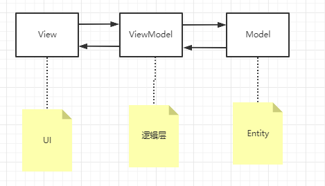
>
> 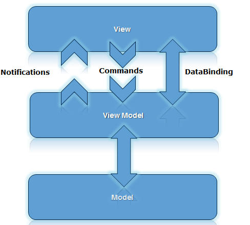
>
> 
>
> 打开计划大厅
>
> 发现内存暴涨，持续一段时间后频繁GC导致程序卡死
>
> 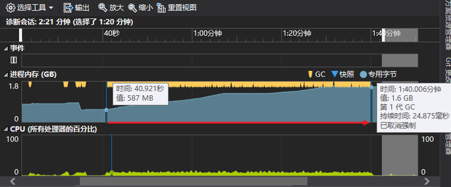
>
> 重点看下View-ViewModel
>
> 首页主要包含两个page MainPage DataGridPage
>
> 分析单个页面所占用的内存大小
>
> 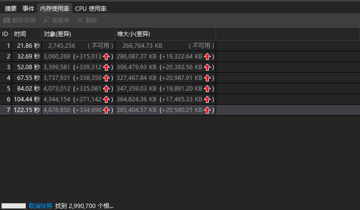
>
> 刷新的时候主要改变的是DataGridPage的数据，210条数据
>
> UI+逻辑层数据大概每次都要占用19,000kb的内存~= 18MB
>
> 目前猜测是Entity占内存过多，这里定位一下发现 entity占用的内存正好是每次新增的内存大小
>
> 与初次的内存快照对比
>
> 154552+8400+6152+1680 = 170784kb
>
> 再加上剩余的UI层占用的内存正好对的上对一次内存增加量
>
> 这里210正好是当前页签的元素数量
>
> 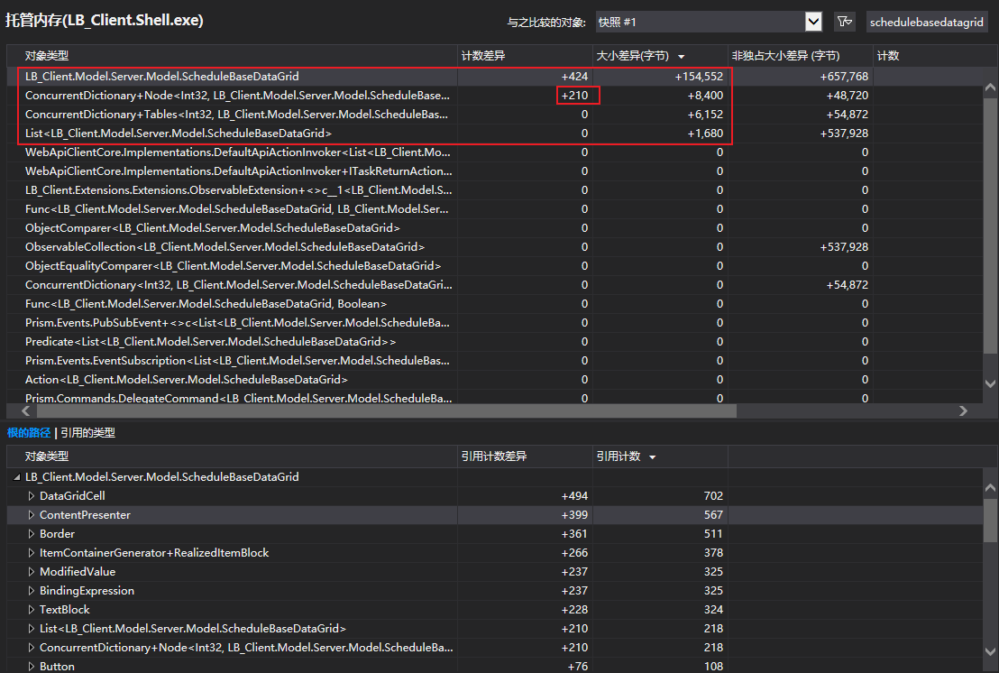
>
> 每次执行保存按钮的时候需要知道那些数据被修改了，这里原本也能使用WPF框架自带的propertyChangeNofity(),但是原本LB架构导致的依赖关系使Entity位于依赖链的最底层导致Entity无法与高层ViewModel交互，这里就使用Map来存储初始Entity，等提交的时候对比MD5值查看是否被修改，考虑到每周计划量这里就使用Map使每次对比的时候再O(1)时间内找出初始值。
>
> 但是这里看来上一次更新的数据并没有被GC
>
> 查看使用逻辑发现集合使用的New而不是Clear()
>
> `clear()，清除了存储的数据，之前申请的内存空间依旧不变；`
> `new List(),重新申请新的内存；当数据量很大时，重新申请会比较快`
>
> 所以new的时候又会开启新的内存，旧有的数据虽然没有引用但是还没达到GC的阈值就一直占用内存
>
> 这里就改用Clear（）
>
> 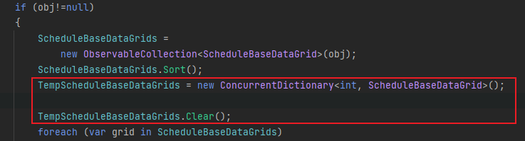
>
> 然后让我们关闭计划大厅窗口又重新打开发现内存占用会更多远超于19MB,这明显与单纯切页面占用内存更多
>
> 把目光转型UI 和 逻辑层
>
> 观察UI层的计数发现每次打开一次都新New一个页面，而原来的页面并未关闭，这里走了标准的关闭流程，并且额外调用了强制GC发现 GC并不起作用，这时候猜测UI界面其实存在引用导致GC无法回收，
>
> 这里打开计划大厅可以类比Shell sh执行一个脚本，只是从主线程fork了一个子线程，主线程依然持有这样页面的引用
>
> 
>
> 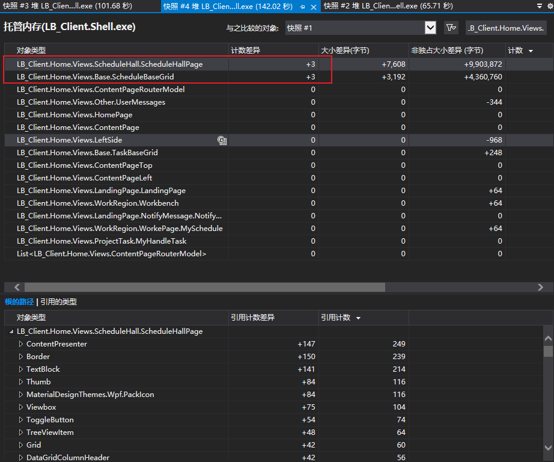
>
> 同样的通过对HTTP请求进行抓包发现
>
> 每次都会n^2个请求
>
> MVVM的事件机制
>
> 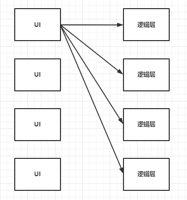
>
> 

> 如果以new Page()的方式加载 后切换其他的新页面时 原来的内存并不会释放， 加载新页面内存就会一直往上涨
>
> 因为单个页面内存占用并不高 所以平时测试也看不太出来，但是放到客户场地运行一段时间后 内存就不够用了
>
> Page1 page = new Page1();
> famTest.Navigate(page); 不要每次都New 把它放到一个静态变量里
>
> #### 解决办法:
>
> **切换页面不要每次都重新实例化一个新page，而是做成一个单例**
>
> 

> 优化结果
>
> 20000 -> 6000  = 1400
>
> 节省了3.4倍的内存
>
> 1400/20000 * 100% = 70%
>
> 
>
> 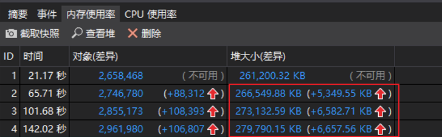
>
> 
>
> 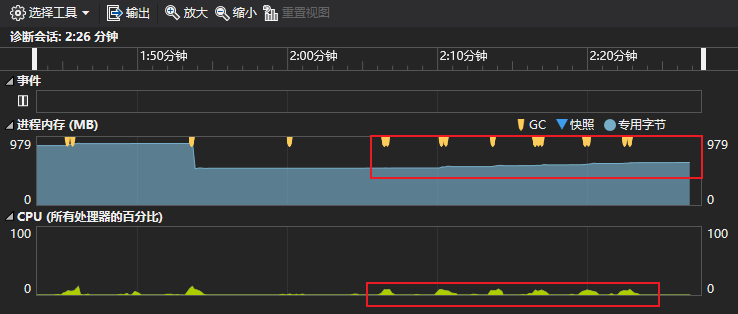

### （二）回顾和工作思考

> *1**、工作**体会和经验**总结**
> \* *谈谈自己对项目以及自己负责的工作的理解和思考*

减少沟通成本提升效率

实现功能前多和PM沟通确定好想要的东西是什么样子的，

光速入门，多问题更要学会自己解决问题

搜索解决方案的能力

实现功能前先把问题抽象为简单的流程图看啊可能这个功能是不是有和其他地方关联的部分，是不是可以做成一个组件或者一个通用的功能

功能分析阶段思考一下自己能否依照现有的技术实现，如果不行需要有需要了解那方便的知识，不要先做，万一碰到流程上的难点前面所作的可能直接白给了

是否有相似的功能可以借鉴，提升效率

## 团队融入和合作

### 团队融入与合作

> *1**、聊聊对部门和工作室的感受*
>
> *2**、结合案例聊聊与其它成员的合作过程和心得*

1. 感受
2. 合作

> 单子状态变化的逻辑敲定
>
> 沟通
>
> 表达
>
> 理解
>
> 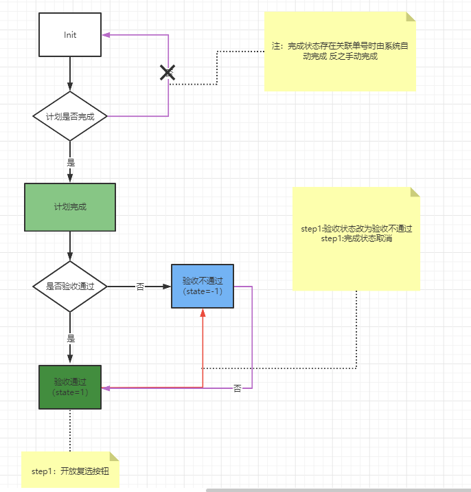

## 未来规划

### （一）未来工作目标和规划：

> *1.**未来半年到**1**年内个人的工作目标和规划是什么*
>
> 在工作中仍处于一学习阶段，要多多学习多成长，能有独当一面的能力
>
> 在掌握工作所需的技能时拓宽自己的技术视野，看看那些技术能够引入到项目开发中，能提升多少效率
>
> 生活中要掌握自己的作息和生活节奏，不能让工作日决定你什么时候起床，再休日的时候也要有清晰的规划确定好这一天要完成什么目标

### （二）个人能力提升和发展：

> *1.**对于个人未来的职业规划和期望是怎样的*
>
> 在对服务器开发这方面掌握的差不多的情况下，了解些客户端方面的东西，独立游戏人了属于是（#狗头
>
> *2.**结合职业规划，认为自己在哪些方面还需要更多的积累和学习*
>
> 技术的深度和广度上还是十分欠缺

## 建议和意见

### （一）合理化建议和意见

> *各方面都可以，比如流程**优化和改进、**技术分享迭代、团队**管理和氛围**等、项目上的建议等*